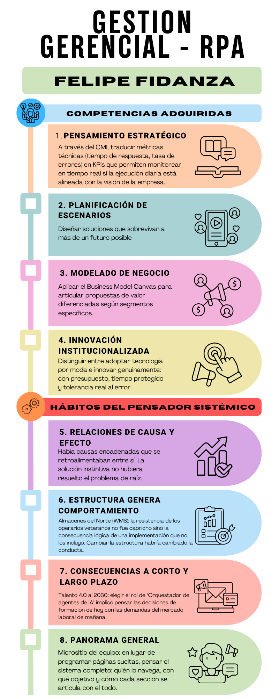
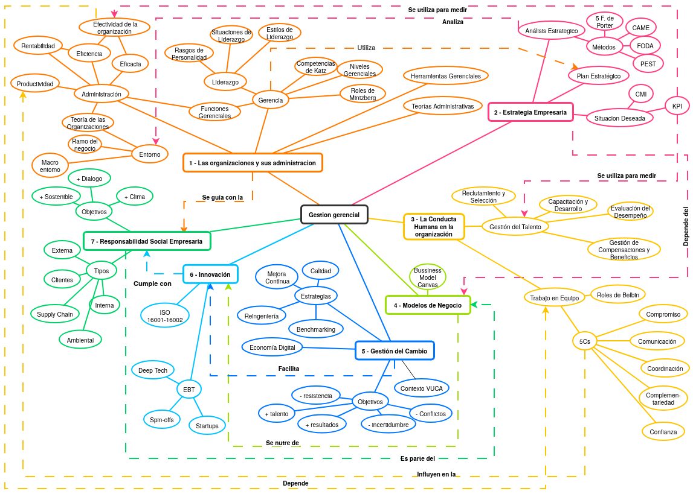

## Parte A – Preguntas por Unidad

### Unidad 1 – Las Organizaciones y su Administración

**Pregunta 1:** ¿De qué manera el enfoque sociotécnico obliga a un ingeniero en sistemas a trascender la implementación de software y hardware para convertirse en un arquitecto de la organización?

**Pregunta 2:** ¿Cómo impacta la ética y la visión sistémica en la toma de decisiones de un gerente ante la incertidumbre y los factores no controlables del macroentorno actual?

---

### Unidad 2 – Estrategia Empresaria

**Pregunta 3:** ¿Cómo puede un Cuadro de Mando Integral (CMI) transformar métricas técnicas aisladas en una narrativa estratégica que asegure la supervivencia y competitividad de una empresa de tecnología?

**Pregunta 4:** ¿Por qué el análisis de escenarios futuros es una competencia crítica para el profesional de sistemas que busca diseñar soluciones tecnológicas sostenibles en un horizonte a largo plazo?

---

### Unidad 3 – La Conducta Humana en la Organización

**Pregunta 5:** ¿Cómo debe redefinirse el liderazgo situacional para gestionar eficazmente equipos de "Talento 4.0" donde la autonomía y la deslocalización son los pilares de la cultura laboral?

**Pregunta 6:** ¿Cuál es el rol estratégico de las "habilidades humanas" frente a las "habilidades técnicas" en un entorno de Industria 5.0 donde el trabajador debe colaborar estrechamente con la inteligencia artificial?

---

### Unidad 4 – Modelos de Negocios

**Pregunta 7:** ¿De qué forma la segmentación de clientes determina el éxito o fracaso de una propuesta de valor tecnológica, evitando que el producto sea percibido como un simple commodity?

**Pregunta 8:** ¿En qué medida el Modelo Canvas actúa como un puente entre la visión creativa del emprendedor y la rigurosidad operativa necesaria para lograr la escalabilidad de un negocio digital?

---

### Unidad 5 – Dinámica del Cambio

**Pregunta 9:** ¿Bajo qué criterios sistémicos un ingeniero-gerente debe decidir entre aplicar una mejora continua incremental o arriesgarse a una reingeniería total de procesos en una organización en crisis?

**Pregunta 10:** ¿Cómo puede gestionarse la resistencia al cambio cultural cuando la automatización y la inteligencia artificial son percibidas como amenazas a la identidad y seguridad de los trabajadores veteranos?

---

### Unidad 6 – Innovación

**Pregunta 11:** ¿Qué condiciones culturales y estructurales diferencian a una organización que realmente innova de una que simplemente adopta tecnologías por moda o presión competitiva?

**Pregunta 12:** ¿De qué manera el rol del intrapreneur y la vigilancia tecnológica potencian el desarrollo de Empresas de Base Tecnológica (EBT) en mercados dinámicos?

---

### Unidad 7 – Responsabilidad Social Empresaria (RSE)

**Pregunta 13:** ¿Cómo puede el área de IT integrar la sustentabilidad (Green IT) no solo como una política de imagen corporativa, sino como un compromiso ético transversal en el diseño de infraestructura?

**Pregunta 14:** ¿De qué manera la RSE interna impacta directamente en la retención del talento especializado y en la reputación de una firma tecnológica a largo plazo?

---

### Hábitos del Pensador Sistémico identificados

**4. Identifica la naturaleza circular de relaciones complejas de causa y efecto**: Este hábito lo ejercité específicamente en el **Desafío 7 – Diagrama de Ishikawa (Escenario BurgerClick)**. Al construir el diagrama con las “6M”, descubrí que el síntoma inicial (comida fría) no tenía una causa lineal, sino que las causas estaban encadenadas y se retroalimentaban: una freidora descalibrada generaba tiempos irregulares, lo que aumentaba la espera de los repartidores y, ante la falta de una zona de espera, estos se retiraban antes de recibir el pedido. La herramienta me obligó a mirar el sistema completo antes de proponer una acción, evitando soluciones instintivas y parciales.

**3. Reconoce que la estructura de un sistema genera su comportamiento**: Lo puse en práctica en el **Desafío 6 – Gestión del Cambio (Escenario Almacenes del Norte S.A.)** al analizar el fracaso de la implementación de un sistema WMS. Determiné que la resistencia de los operarios veteranos no era un capricho, sino la respuesta lógica a una estructura organizacional que carecía de canales de participación, capacitación previa y líderes informales involucrados. El análisis concluyó que cambiar la estructura (incorporando referentes como agentes del cambio) habría generado un comportamiento de aceptación en lugar de resistencia.

**10. Considera tanto las consecuencias a corto como a largo plazo de las acciones**: Este hábito fue central en la actividad sobre **Talento 4.0 proyectado al 2030**. Al elegir el rol de “Orquestador de agentes de IA”, analicé que, aunque en el corto plazo la automatización puede desplazar roles de ejecución técnica, en el largo plazo surgirá una demanda crítica de capacidades para supervisar y coordinar sistemas autónomos. Esto implicó reflexionar sobre cómo las decisiones actuales de formación técnica y el cultivo de ciertos hábitos tienen consecuencias acumulativas en la carrera profesional futura.

**1. Busca comprender el panorama general (Seeks to understand the big picture)**: Lo ejemplifico en la **programación del micrositio del equipo**, donde una tarea técnica se transformó en un ejercicio sistémico. En lugar de solo coleccionar páginas, pensé en el sistema completo: la navegación del usuario (la profesora), la relación entre secciones individuales y actividades grupales, y qué estructura tenía sentido para los objetivos de evaluación. Mirar el proyecto como un todo me facilitó el diseño de una solución integral y funcional.

---

## Parte B – Desarrollo de la RPA

### Respuestas a las preguntas

---

**Unidad 1 – Pregunta 1:** ¿De qué manera el enfoque sociotécnico obliga a un ingeniero en sistemas a trascender la implementación de software y hardware para convertirse en un arquitecto de la organización?

El enfoque sociotécnico exige reconocer que la organización es un sistema donde las personas, la estrategia y la tecnología interactúan de forma interdependiente. Para el ingeniero, esto implica que una solución técnica no es un fin en sí misma, sino un componente que debe adaptarse a las necesidades y capacidades humanas para ser efectiva. De esta forma, el profesional deja de ser un mero ejecutor técnico para convertirse en un arquitecto que diseña "algoritmos de decisión" aplicados a la operación total del sistema.

---

**Unidad 1 – Pregunta 2:** ¿Cómo impacta la ética y la visión sistémica en la toma de decisiones de un gerente ante la incertidumbre y los factores no controlables del macroentorno actual?

La ética empresarial determina cómo el gerente ejerce su autoridad y trata a los miembros del sistema, siendo la base de la confianza y la sostenibilidad institucional. Ante un macroentorno caracterizado por factores económicos y tecnológicos no controlables que actúan con máxima incertidumbre, la visión sistémica permite al gerente no buscar culpables individuales ante fallos, sino analizar si el diseño organizacional y el flujo de información son coherentes con los valores de la empresa.

---

**Unidad 2 – Pregunta 3:** ¿Cómo puede un Cuadro de Mando Integral (CMI) transformar métricas técnicas aisladas en una narrativa estratégica que asegure la supervivencia y competitividad de una empresa de tecnología?

El CMI supera la visión puramente financiera al establecer un sistema causal donde la capacitación del personal (aprendizaje) impulsa la optimización del desarrollo (procesos), lo que resulta en software de mejor calidad y mayor satisfacción del usuario (clientes). Esta herramienta traduce datos técnicos, como el tiempo de respuesta o la tasa de errores, en indicadores clave (KPI) que permiten monitorear en tiempo real si la ejecución técnica está alineada con la visión estratégica de ser una empresa eficiente y escalable.

---

**Unidad 2 – Pregunta 4:** ¿Por qué el análisis de escenarios futuros es una competencia crítica para el profesional de sistemas que busca diseñar soluciones tecnológicas sostenibles en un horizonte a largo plazo?

Diseñar soluciones tecnológicas sin contemplar escenarios futuros es equivalente a construir arquitectura para un edificio sin prever las ampliaciones que podría necesitar en los próximos años. En tecnología, donde los paradigmas cambian drásticamente en períodos cortos, el profesional que solo diseña para el presente acumula deuda técnica desde el primer día. Pensar en escenarios —¿qué pasa si la computación cuántica vuelve obsoleta la criptografía actual?, ¿si una regulación restringe el uso de IA para el que está diseñado el sistema?— no paraliza la decisión sino que la hace más robusta. El valor no está en adivinar cuál escenario se cumplirá, sino en construir soluciones que sobrevivan a más de uno.

---

**Unidad 3 – Pregunta 5:** ¿Cómo debe redefinirse el liderazgo situacional para gestionar eficazmente equipos de "Talento 4.0" donde la autonomía y la deslocalización son los pilares de la cultura laboral?

El liderazgo situacional en el contexto del Talento 4.0 debe evolucionar hacia un modelo de apoyo y empoderamiento en lugar de uno autoritario o puramente controlador. Dado que estos trabajadores valoran la libertad, la autonomía y el aprendizaje continuo, el líder debe actuar como un orquestador que facilita espacios de co-creación y asegura que la cultura organizacional sea un acelerador, y no un freno, para la experimentación tecnológica.

---

**Unidad 3 – Pregunta 6:** ¿Cuál es el rol estratégico de las "habilidades humanas" frente a las "habilidades técnicas" en un entorno de Industria 5.0 donde el trabajador debe colaborar estrechamente con la inteligencia artificial?

En la Industria 5.0, el concepto de "mutualismo cyborg" redefine el trabajo colaborativo, donde las máquinas asumen tareas repetitivas y el humano se libera para tareas de diseño y resolución de contingencias. En este escenario, las habilidades humanas de Katz —capacidad de comunicación, liderazgo y manejo de conflictos— se vuelven más críticas que las técnicas, ya que permiten orquestar la tecnología como una infraestructura al servicio de la creatividad y el juicio ético.

---

**Unidad 4 – Pregunta 7:** ¿De qué forma la segmentación de clientes determina el éxito o fracaso de una propuesta de valor tecnológica, evitando que el producto sea percibido como un simple commodity?

La segmentación de clientes es el primer paso para no caer en la mediocridad comercial, permitiendo orientar los productos tecnológicos hacia necesidades y requisitos específicos de nichos o mercados diversificados. Al comprender profundamente para quién se crea valor, la empresa puede diseñar una propuesta de valor que resuelva problemas reales, lo que justifica que el cliente esté dispuesto a pagar un precio justo en lugar de buscar la opción más barata.

---

**Unidad 4 – Pregunta 8:** ¿En qué medida el Modelo Canvas actúa como un puente entre la visión creativa del emprendedor y la rigurosidad operativa necesaria para lograr la escalabilidad de un negocio digital?

El Modelo Canvas es una metodología visual que obliga a pensar en las nueve dimensiones fundamentales que hacen viable y factible la operatividad del negocio. Actúa como un puente porque permite plasmar ideas innovadoras en una estructura clara de recursos y actividades clave, facilitando que el equipo de sistemas entienda la lógica de creación de ingresos y la estructura de costos detrás de cada desarrollo técnico.

---

**Unidad 5 – Pregunta 9:** ¿Qué factores determinan si una organización necesita evolucionar sus procesos gradualmente o cuestionarlos desde cero, y qué consecuencias sistémicas tiene cada decisión?

Elegir entre mejora continua y reingeniería no es una decisión técnica sino estratégica, y el costo de elegir mal puede ser significativo. Aplicar mejora continua donde se necesita reingeniería genera capas de parches que acumulan complejidad sin resolver el problema de fondo. Aplicar reingeniería donde solo hacían falta ajustes destruye conocimiento organizacional valioso y genera resistencias innecesarias.

La pregunta clave no es "¿cuál herramienta es mejor?" sino "¿qué diagnóstico tenemos del proceso actual?". Si la lógica general del proceso es correcta pero tiene ineficiencias puntuales, el PDCA es el camino. Si el proceso fue diseñado para una realidad —tecnológica, competitiva o regulatoria— que ya no existe, ningún ciclo de mejora será suficiente.

Sistémicamente, también importa quién absorbe el impacto: la reingeniería concentra el riesgo y el esfuerzo en un momento, mientras que la mejora continua los distribuye en el tiempo. Ninguna es intrínsecamente superior; la clave está en leer correctamente el estado del sistema antes de actuar.

---

**Unidad 5 – Pregunta 10:** ¿Cómo puede gestionarse la resistencia al cambio cultural cuando la automatización y la inteligencia artificial son percibidas como amenazas a la identidad y seguridad de los trabajadores veteranos?

Gestionar la resistencia al cambio requiere que el ingeniero-gerente involucre a los trabajadores veteranos en el diseño de la solución, reconociendo que su resistencia suele basarse en el temor a que su conocimiento empírico pierda valor. En lugar de imponer la tecnología por autoridad jerárquica, se debe comunicar con transparencia, capacitar al personal y construir "victorias tempranas" que demuestren que el sistema está diseñado para potenciar al humano y no para reemplazarlo.

---

**Unidad 6 – Pregunta 11:** ¿Por qué la mayoría de las empresas que se declaran "innovadoras" no logran sostener esa innovación en el tiempo, y qué condiciones concretas la hacen estructuralmente posible?

La mayoría de las organizaciones que se declaran innovadoras están en realidad en modo de adopción acelerada: incorporan herramientas porque la competencia las incorpora, porque un directivo leyó un artículo, o porque aparecieron en el ranking de tendencias. Eso no es innovación, es gestión del FOMO corporativo.

Lo que diferencia a una organización que genuinamente innova es que el proceso de generación de ideas está institucionalizado: tiene presupuesto asignado, tiene tiempo protegido de la urgencia operativa, y tiene mecanismos reales para capturar ideas de cualquier nivel jerárquico. La palabra "reales" es clave, porque muchas organizaciones dicen tolerar el error pero penalizan a quien falla.

Estructuralmente, la innovación sostenida requiere que existan roles dedicados a la exploración, separados de quienes explotan lo que ya funciona. Sin esa separación, la urgencia del día a día consume todos los recursos y la innovación queda como una línea en la visión estratégica que nunca se ejecuta.

---

**Unidad 6 – Pregunta 12:** ¿De qué manera el rol del intrapreneur y la vigilancia tecnológica potencian el desarrollo de Empresas de Base Tecnológica (EBT) en mercados dinámicos?

El intrapreneur actúa como un agente de cambio interno que impulsa proyectos innovadores utilizando los recursos de la empresa, lo que es vital para la renovación continua. Esta mentalidad, sumada a la captación sistemática de información externa sobre ciencia y tecnología, permite a las organizaciones transformarse en Empresas de Base Tecnológica (EBT) capaces de superar el "valle de la muerte" comercial mediante el escalamiento de resultados de I+D.

---

**Unidad 7 – Pregunta 13:** ¿Cómo puede el área de IT integrar la sustentabilidad (Green IT) no solo como una política de imagen corporativa, sino como un compromiso ético transversal en el diseño de infraestructura?

El área de IT puede integrar el concepto de "Green IT" mediante decisiones concretas en el diseño de infraestructura escalable y modular que reduzca el desperdicio y mejore la eficiencia energética. Esto requiere que la sustentabilidad sea un compromiso ético que guíe el ciclo de vida del software y el reciclaje de basura electrónica, evitando que la RSE sea solo una campaña publicitaria vacía conocida como greenwashing.

---

**Unidad 7 – Pregunta 14:** ¿De qué manera la RSE interna impacta directamente en la retención del talento especializado y en la reputación de una firma tecnológica a largo plazo?

La RSE interna se enfoca en el desarrollo y bienestar de los empleados, lo cual es determinante en la productividad y en la reducción de la rotación de personal en un mercado altamente competitivo. Una empresa que invierte en su gente y mantiene un clima laboral positivo no solo mejora su reputación externa, sino que construye un equipo resiliente capaz de sostener la ventaja competitiva a través del conocimiento acumulado.

---

### Síntesis Reflexiva

Escribir esta ruta personal de aprendizaje al finalizar la cursada de Gestión Gerencial me obligó a hacer algo que raramente hago con naturalidad, mirar hacia atrás. No para evaluar si aprobé o rendí bien, sino para entender en qué punto estaba cuando empecé la materia y en qué punto estoy ahora.

Las unidades que más movieron mi perspectiva fueron las de Dinámica del Cambio e Innovación. La primera porque me di cuenta de que la resistencia al cambio no es irracionalidad ni capricho, sino una respuesta lógica de personas a quienes un sistema no preparó. Entender eso cambia completamente cómo uno planificaría la implementación de cualquier proyecto tecnológico. La segunda porque me obligó a ser honesto con una pregunta incómoda: ¿qué diferencia hay entre innovar genuinamente y simplemente seguir lo que está de moda? Esa distinción, entre institucionalizar la exploración y declararse innovador en la visión estratégica, es algo que no quiero perder de vista cuando emprenda.

El proceso de formular las preguntas fue revelador en sí mismo. Cuando terminé el primer borrador, la mayoría se respondían solas con una definición del apunte. Eso me llevó a reescribirlas todas con un criterio diferente: si la respuesta no me generaba algo nuevo para pensar, la pregunta estaba mal formulada. Ese ejercicio me sirvió más como práctica de pensamiento crítico que como repaso de contenido, y creo que esa es exactamente la intención detrás del trabajo.

Los hábitos del pensador sistémico que identifiqué en mi recorrido (las relaciones circulares de causa y efecto, la estructura que genera comportamiento, las consecuencias a largo plazo, la visión del panorama general) no son hábitos que incorporé durante la cursada, sino hábitos que ya practicaba de forma intuitiva y que ahora puedo nombrar y aplicar de manera más consciente. Esa es quizás la diferencia más valiosa, pasar de hacer algo bien por intuición a entender por qué funciona y cuándo aplicarlo.

Como pendiente, reconozco que me queda mucho por desarrollar en el área de liderazgo y gestión del talento. Mis preguntas sobre Talento 4.0 e Industria 5.0 fueron las más difíciles de responder, no porque la bibliografía sea escasa, sino porque requieren una experiencia en gestión de personas que todavía no tengo. Es un área donde sé que tengo más lecturas que vivencias. También quiero profundizar en el vínculo entre modelo de negocio e innovación, especialmente a la hora de pensar una startup tecnológica en Argentina, donde las condiciones de mercado, la disponibilidad de capital y el ecosistema emprendedor tienen particularidades que los casos de estudio de la bibliografía no siempre contemplan.

---

### Infografía

### Mapa conceptual de la materia

