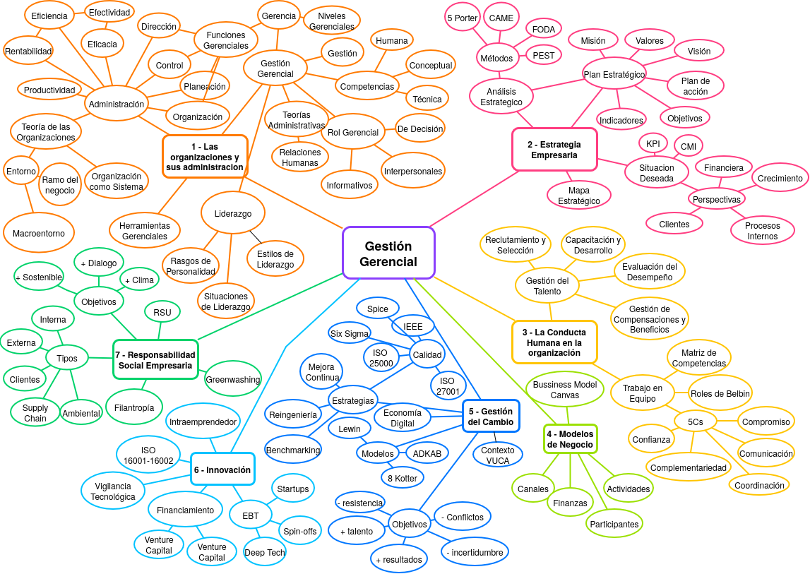

---
descripcion:
 Apasionado por construir sistemas. Me interesa aprender constantemente, experimentar con nuevas tecnologías y entender cómo funcionan las cosas en profundidad. Mis objetivos son crecer profesionalmente en el área tecnológica y seguir ampliando mi experiencia en proyectos reales. 
nombre: Lautaro Acosta Quintana
heroVideo: "https://youtu.be/u7xxYFPv--Y?si=T68ExIpbso5S8zeI"
---

# Ruta Personal de Aprendizaje (RPA)

## Parte A -- Preguntas por Unidad

### Unidad 1 -- Las Organizaciones y su Administración
### Unidad 2 -- Estrategia Empresaria
### Unidad 3 -- La Conducta Humana en la Organización
### Unidad 4 -- Modelos de Negocios
### Unidad 5 -- Dinámica del Cambio
### Unidad 6 -- Innovación
### Unidad 7 -- Responsabilidad Social, Sustentabilidad y Sostenibilidad Empresaria

---

### Hábitos del Pensador Sistémico
#### Relaciones circulares de causa y efecto
#### Comprender el panorama general
#### La estructura genera comportamiento
#### Consecuencias a corto y largo plazo

---

## Parte B -- Desarrollo de la RPA

### Respuestas a las preguntas
#### Unidad 1
#### Unidad 2
#### Unidad 3
#### Unidad 4
#### Unidad 5
#### Unidad 6
#### Unidad 7

---

## Reflexión final

---
### Mapa conceptual de la materia

