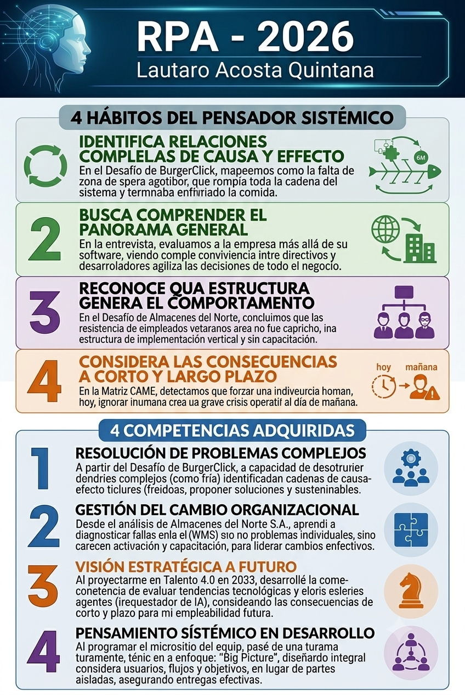

---
descripcion:
 Apasionado por construir sistemas. Me interesa aprender constantemente, experimentar con nuevas tecnologías y entender cómo funcionan las cosas en profundidad. Mis objetivos son crecer profesionalmente en el área tecnológica y seguir ampliando mi experiencia en proyectos reales. 
nombre: Lautaro Acosta Quintana
heroVideo: "https://youtu.be/u7xxYFPv--Y?si=T68ExIpbso5S8zeI"
---

# Ruta Personal de Aprendizaje (RPA)

## Parte A -- Preguntas por Unidad

A continuación, se presentan dos preguntas por unidad diseñadas bajo los criterios de reflexión profesional, visión sistémica y apertura conceptual, seguidas de sus respectivas respuestas fundamentadas en las fuentes.

### Unidad 1: Las Organizaciones y su Administración
1.  ¿De qué manera la transición de ver a la empresa como una jerarquía rígida a verla como un **sistema abierto** redefine la responsabilidad ética de un ingeniero al implementar sistemas de información que alteran el flujo de datos organizacional?
2.  Analizando los roles de Mintzberg, ¿cómo puede el ingeniero-gerente evitar que su función como "centro nervioso" de información se transforme en un **cuello de botella** que incremente la entropía del sistema en lugar de reducir la incertidumbre?

### Unidad 2: Estrategia Empresaria
3.  Si el Cuadro de Mando Integral se define como un **sistema causal**, ¿qué riesgos sistémicos asume una organización tecnológica que decide priorizar métricas financieras inmediatas sobre los indicadores de la perspectiva de aprendizaje y crecimiento?
4.  ¿Cómo debe el **pensamiento estratégico** condicionar la selección de arquitecturas tecnológicas en una empresa, considerando que la tecnología debe actuar como infraestructura y no como un fin en sí misma dentro de un entorno VUCA?

### Unidad 3: La Conducta Humana en la Organización
5.  Ante el avance de la automatización y la IA, ¿cómo se debe reconfigurar la dimensión del **"saber ser"** en el talento 4.0 para que el trabajador del conocimiento sea un orquestador creativo y no un simple ejecutor de procesos automatizados?
6.  ¿Bajo qué argumentos podemos sostener que la **cultura organizacional** es el "sistema operativo" real de la empresa, y de qué forma una "incompatibilidad" entre esta cultura y una nueva tecnología puede llevar al fracaso de un proyecto técnicamente perfecto?

### Unidad 4: Modelos de Negocios
7.  ¿Cómo una **propuesta de valor** mal definida desde el inicio del Modelo Canvas puede forzar una arquitectura de sistemas ineficiente o costosa, comprometiendo la viabilidad financiera del proyecto a largo plazo?
8.  En el contexto de las **startups**, ¿de qué manera el uso de plataformas tecnológicas y modelos de monetización flexibles altera la gestión de los "recursos clave" en comparación con los modelos de negocio tradicionales?

### Unidad 5: Gestión del Cambio
9.  Analizando el modelo de Lewin, ¿qué impacto tiene un proceso de **"descongelamiento"** brusco (como el visto en Almacenes del Norte) sobre el capital intelectual de la empresa, especialmente cuando el conocimiento empírico de los veteranos es ignorado?
10. ¿En qué punto la **reingeniería de procesos** deja de ser una herramienta de optimización para convertirse en un riesgo para la homeostasis organizacional si no se contempla la resistencia al cambio como un bucle de retroalimentación natural?

### Unidad 6: Innovación
11. ¿Cómo puede el perfil del **intrapreneur** actuar como un catalizador de "neguentropía" en organizaciones tradicionales, y qué barreras estructurales suelen asfixiar este pensamiento lateral en las áreas de sistemas?
12. Ante la adopción de **tecnologías emergentes** (IA, IoT), ¿cómo debe equilibrar un líder tecnológico la búsqueda de competitividad con la evaluación ética de las consecuencias no intencionadas de estos sistemas en el ecosistema social?

### Unidad 7 -- Responsabilidad Social, Sustentabilidad y Sostenibilidad Empresaria
13. ¿De qué manera el concepto de **Green IT** permite que el área de sistemas deje de ser vista exclusivamente como un centro de consumo energético para transformarse en un pilar de la rentabilidad y la reputación estratégica de la empresa?
14. ¿Es posible que la **Responsabilidad Social Empresaria** sea una ventaja competitiva genuina en el sector IT, o corre el riesgo de ser solo una máscara de "Greenwashing" si no se integra en el núcleo del modelo de negocio y los valores de los líderes?

### Hábitos del Pensador Sistémico
#### Identifica la naturaleza circular de relaciones complejas de causa y efecto:

Durante el Desafío 7 (Diagrama de Ishikawa - Escenario BurgerClick), se analizó el problema de la "comida fría". En lugar de atribuirlo a una sola causa lineal, se identificó una cadena retroalimentada: la falta de mantenimiento en las freidoras generaba tiempos irregulares, lo que aumentaba la espera de los repartidores; al no haber una zona de espera física, los repartidores se retiraban antes de recibir el pedido, dejando la comida abandonada. Este hábito permitió entender que la solución no era solo técnica (calibrar la máquina), sino sistémica.

#### Reconoce que la estructura de un sistema genera su comportamiento:

En el Desafío 6 (Gestión del Cambio - Almacenes del Norte S.A.), se evaluó por qué fracasó la implementación de un sistema WMS. Se determinó que la resistencia de los operarios veteranos no era un capricho individual, sino el resultado de una estructura organizacional que no incluía canales de participación ni capacitación previa. Cambiar la estructura (involucrar a líderes informales y capacitar antes del lanzamiento) habría generado un comportamiento de aceptación en lugar de rechazo.

#### Considera tanto las consecuencias a corto como a largo plazo de las acciones:

En la Actividad Talento 4.0 en 2030, el ejercicio de proyectarse profesionalmente implicó analizar tendencias tecnológicas actuales. Se eligieron roles como el de "Orquestador de agentes de IA" entendiendo que, si bien a corto plazo la automatización desplaza tareas técnicas de ejecución, a largo plazo la capacidad de diseñar y supervisar sistemas complejos será lo más valioso. Esto obligó a considerar cómo las decisiones de formación tomadas hoy impactan la empleabilidad futura.

#### Busca comprender el panorama general:

Al programar el micrositio del equipo, la tarea dejó de ser puramente técnica para convertirse en un ejercicio de visión global. Se debió pensar el proyecto como un sistema con usuarios (evaluadores), objetivos y flujos de navegación, en lugar de una simple colección de páginas aisladas. Ver la "Big Picture" permitió que la entrega fuera una solución integral y no solo un producto funcional.

## Parte B -- Desarrollo de la RPA

### Respuestas a las preguntas
#### Unidad 1

1.  La transición al enfoque de **sistema abierto** implica que el ingeniero ya no diseña soluciones aisladas, sino que reconoce que la organización intercambia insumos y energía con su entorno. La responsabilidad ética se redefine porque cada sistema de información afecta los roles de las personas y las interacciones entre áreas; una implementación que ignora estas conexiones puede generar caos en lugar de orden. El ingeniero debe actuar con integridad, entendiendo que el flujo de datos que crea es la base de la toma de decisiones y, por ende, de la estabilidad de todo el sistema social que es la empresa.

2.  Para evitar ser un cuello de botella, el ingeniero-gerente debe utilizar su rol de "centro nervioso" para **diseminar la información** de forma transversal y no centralizarla. Bajo una mirada sistémica, el administrador debe ser un puente y no una barrera; esto se logra empoderando a los equipos y fomentando la transparencia, de modo que la información fluya como un recurso que reduzca la incertidumbre colectiva, permitiendo que la organización se adapte más rápido a los cambios del mercado.

#### Unidad 2

3.  Priorizar lo financiero sobre el aprendizaje genera un **desequilibrio sistémico**. En un sistema causal como el CMI, el aprendizaje y crecimiento (capacitación, cultura) son los motores que impulsan la mejora de procesos; si estos fallan, la calidad del software cae, los clientes se insatisface y, finalmente, la rentabilidad financiera se desploma a largo plazo. Ignorar la base de la pirámide causal compromete la supervivencia organizacional ante cualquier cambio del entorno.

4.  El **pensamiento estratégico** dicta que la tecnología debe ser la "infraestructura" que soporte el "diseño del sistema" (la estrategia). En un entorno VUCA, elegir una tecnología solo por tendencia es un error; la arquitectura debe ser flexible y modular para permitir ajustes de rumbo. La estrategia debe preceder a la herramienta técnica para asegurar que la inversión genere ventajas competitivas sostenibles y no solo una modernización superficial.

#### Unidad 3

5.  El **talento 4.0** debe fortalecer sus habilidades humanas y conceptuales (el "saber ser" y el "saber"), ya que las habilidades técnicas de ejecución son las más propensas a ser automatizadas. El trabajador del conocimiento debe aportar creatividad, juicio ético y visión sistémica; su valor reside en su capacidad para diseñar y supervisar sistemas complejos (como un orquestador de agentes de IA), dejando las tareas repetitivas a las máquinas para enfocarse en la toma de decisiones críticas.

6.  La **cultura organizacional** es el conjunto de valores y normas que determinan "cómo se hacen las cosas"; si esta cultura es rígida o teme al cambio, rechazará la tecnología como un cuerpo extraño. Un proyecto técnicamente perfecto fracasa si no hay una compatibilidad cultural (la gente no lo adopta, no lo entiende o lo resiste por miedo al reemplazo), lo que demuestra que la dimensión humana es la que valida la existencia y utilidad de cualquier sistema de información.

#### Unidad 4

7.  Una propuesta de valor ambigua impide identificar claramente las necesidades del cliente y el problema que se intenta resolver. Esto repercute en el diseño técnico, ya que se pueden construir funcionalidades innecesarias que elevan los **costos de infraestructura** y desarrollo, alejando a la empresa de su punto de equilibrio. Si el "corazón" del modelo (la propuesta) no está alineado con la arquitectura de sistemas, la operatividad del negocio se vuelve financieramente inviable.

8.  Las startups operan bajo modelos de negocio **ágiles y escalables**, donde los recursos clave ya no son solo activos físicos, sino principalmente el talento humano especializado y la propiedad intelectual de sus algoritmos. A diferencia de las empresas tradicionales, gestionan el riesgo mediante la experimentación constante y modelos de ingresos flexibles (como suscripciones o freemium), utilizando la tecnología no solo para operar, sino para capturar y entregar valor de forma disruptiva.

#### Unidad 5
9.  Un **descongelamiento** brusco sin participación destruye el sentimiento de pertenencia y genera una brecha emocional insalvable. Al ignorar el conocimiento empírico de los veteranos, la empresa pierde un capital intelectual crítico que no está documentado; el resultado es una caída de productividad y una pérdida de confianza que puede tardar décadas en reconstruirse, demostrando que la gestión del cambio es, ante todo, gestión de miedos e identidades.

10. La **reingeniería** es un cambio radical que puede romper la homeostasis (equilibrio interno) de la organización si se aplica sin considerar las retroalimentaciones del sistema humano. Cuando la presión por la eficiencia ignora la capacidad de adaptación de las personas, el sistema entra en un estado de conflicto permanente; la resistencia deja de ser un "problema a eliminar" para convertirse en un síntoma de que el cambio está amenazando la supervivencia misma de las partes del sistema.

#### Unidad 6
11. El **intrapreneur** introduce "neguentropía" (orden y renovación) al proponer proyectos que rompen el statu quo desde adentro de la empresa. Sin embargo, la burocracia excesiva y la falta de una cultura que tolere el error suelen asfixiar estos perfiles. En sistemas, esto se ve cuando las áreas técnicas se limitan a "mantener lo existente", bloqueando el pensamiento lateral y la innovación abierta necesaria para adaptarse al entorno cambiante.

12. El líder debe practicar el hábito de considerar las **consecuencias a largo plazo**. No basta con que una tecnología sea factible o viable; debe ser deseable desde una perspectiva humana y ética. La integración responsable de IA o Big Data exige marcos de gobernanza de datos y una evaluación de impacto social, reconociendo que las decisiones de diseño técnico tienen repercusiones profundas en el empleo y la privacidad de los usuarios.

#### Unidad 7
13. El **Green IT** optimiza el consumo energético de los data centers y reduce los residuos electrónicos mediante el uso eficiente de recursos y el diseño de software optimizado. Al integrar estos criterios en la estrategia, el área de IT contribuye directamente a los objetivos de sostenibilidad (ESG) de la empresa, lo que mejora la imagen corporativa ante clientes exigentes y reduce costos operativos, transformando una responsabilidad ética en una ventaja competitiva tangible.

14. La **RSE** solo es genuina cuando es transversal a la organización y está planificada. Si una empresa tecnológica maximiza beneficios a costa del bienestar de sus empleados o del medio ambiente, cualquier acción social es "Greenwashing". Para ser estratégica, debe estar en el "corazón" del líder y del modelo de negocio, entendiendo que el éxito organizacional en el siglo XXI no se mide solo en dinero, sino en el impacto positivo generado en todos los grupos de interés.

## Reflexión final

A lo largo del desarrollo de esta Ruta Personal de Aprendizaje, comprendí que la gestión y la administración de organizaciones son disciplinas mucho más amplias que la toma de decisiones o la planificación de recursos e implican entender sistemas complejos donde las personas, la tecnología, la estrategia y el cambio están profundamente conectados. Los ejercicios de pensamiento sistémico permitieron analizar situaciones considerando relaciones, estructuras e impactos a largo plazo, desarrollando una forma de razonamiento que también encuentro muy cercana al trabajo en tecnología y construcción de sistemas.

Además, la materia aportó una perspectiva más humana sobre los procesos de transformación. Conceptos como cultura organizacional, resistencia al cambio e innovación mostraron que incorporar nuevas herramientas o metodologías no garantiza mejoras por sí solo: el verdadero desafío está en lograr que las personas puedan adaptarse, participar y crecer junto con esos cambios.

También resultó valioso reflexionar sobre el rol que tendrán las tecnologías emergentes en el futuro profesional. Entender que la automatización no reemplaza la necesidad de pensamiento crítico, diseño y capacidad de adaptación refuerza la importancia del aprendizaje continuo y de construir una mirada estratégica más allá del conocimiento técnico.

### Infografía

### Mapa conceptual de la materia

