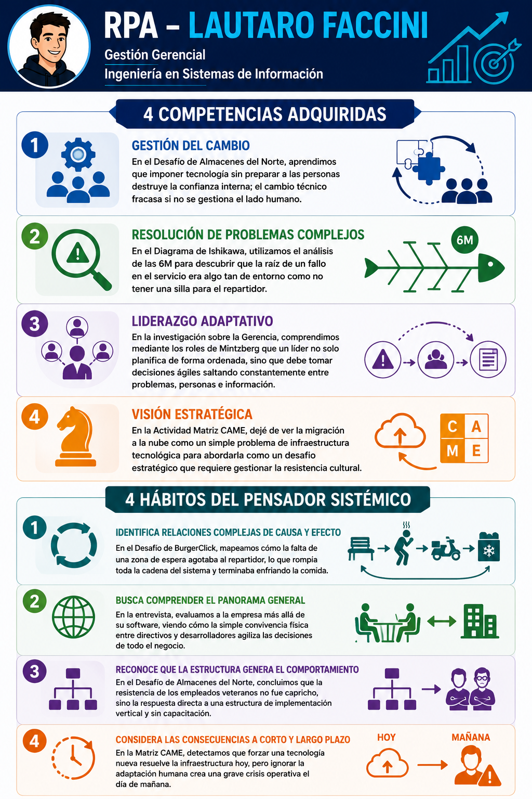

# Ruta Personal de Aprendizaje (RPA)

## Parte A -- Preguntas por Unidad

### Unidad 1 -- Las Organizaciones y su Administración

**Pregunta 1:** ¿De qué manera ver a la organización como un sistema
abierto ayuda a diagnosticar fallas sin culpar solo a las personas?

**Pregunta 2:** ¿Por qué, a medida que un ingeniero asciende a roles de
conducción, las habilidades conceptuales empiezan a pesar más que las
técnicas?

### Unidad 2 -- Estrategia Empresaria

**Pregunta 3:** ¿Cómo puede el Cuadro de Mando Integral ayudar a que la
estrategia no quede en el papel y se traduzca en acciones concretas?

**Pregunta 4:** ¿Por qué planificar escenarios futuros es más útil que
intentar adivinar qué va a pasar en el mundo tecnológico?

### Unidad 3 -- La Conducta Humana en la Organización

**Pregunta 5:** ¿Por qué, en un contexto de Talento 4.0, un líder de
proyectos tecnológicos debería priorizar el apoyo y la comunicación
antes que el control autoritario?

**Pregunta 6:** ¿Cómo la "Teoría Y" favorece la creatividad y el
conocimiento de los trabajadores de IT en contextos inciertos?

### Unidad 4 -- Modelos de Negocios

**Pregunta 7:** ¿Por qué conviene validar primero la propuesta de valor
y el segmento de clientes antes de definir costos y recursos clave?

**Pregunta 8:** ¿Cómo cambia la relación con los clientes cuando una
empresa apunta a un nicho en lugar de buscar un mercado masivo?

### Unidad 5 -- Dinámica del Cambio

**Pregunta 9:** ¿Por qué imponer un nuevo sistema sin preparar a la
organización suele generar resistencia y fracaso?

**Pregunta 10:** ¿Por qué una transformación digital no se sostiene si
solo cambia la tecnología y no la cultura ni los valores compartidos?

### Unidad 6 -- Innovación

**Pregunta 11:** ¿Qué ventaja competitiva real le da la vigilancia
tecnológica a una empresa de software frente a sus competidores?

**Pregunta 12:** ¿Cómo la innovación abierta rompe con la lógica
tradicional de I+D y favorece el desarrollo de empresas de base
tecnológica?

### Unidad 7 -- Responsabilidad Social, Sustentabilidad y Sostenibilidad Empresaria

**Pregunta 13:** ¿Por qué la RSE debe pensarse también desde adentro de
la organización y no solo como una campaña externa?

**Pregunta 14:** ¿Cómo impactan nuestras decisiones de infraestructura
tecnológica en el cuidado ambiental y en la sostenibilidad de la
empresa?

---

### Hábitos del Pensador Sistémico

#### Relaciones circulares de causa y efecto

En el desafío de BurgerClick pude observar que un problema aparentemente
simple como un delivery frío tenía múltiples causas conectadas. Analizar
el sistema completo permitió descubrir que la solución no estaba
únicamente en la comida o en la maquinaria, sino en la interacción entre
diferentes factores.

#### Comprender el panorama general

En el análisis de Devlights entendí que una empresa de software no es
solamente código y herramientas. También influyen la gestión del
talento, la comunicación interna y la forma en que las personas trabajan
juntas.

#### La estructura genera comportamiento

En el caso de Almacenes del Norte comprendí que la resistencia al cambio
no era simplemente rechazo, sino una consecuencia de cómo se había
planteado la implementación del sistema. La falta de participación y
capacitación generó una respuesta negativa.

#### Consecuencias a corto y largo plazo

Al analizar una migración tecnológica comprendí que una decisión técnica
puede tener impactos futuros. Implementar una tecnología sin considerar
la adaptación de las personas puede generar problemas posteriores aunque
la solución inicial parezca correcta.

---

## Parte B -- Desarrollo de la RPA

### Respuestas a las preguntas

#### Unidad 1

1. ``¿De qué manera ver a la organización como un sistema abierto ayuda a diagnosticar fallas sin culpar solo a las personas?``

Ver la organización como sistema abierto me permite entender que un problema casi nunca tiene una sola causa. Cuando aparece una falla, ya no miro solo “quién se equivocó”, sino cómo interactúan personas, procesos, reglas, recursos y entorno. Eso me ayuda a buscar mejoras en la estructura y no solo responsables individuales.

2. ``¿Por qué, a medida que un ingeniero asciende a roles de conducción, las habilidades conceptuales empiezan a pesar más que las técnicas?``

Cuando un ingeniero crece profesionalmente, ya no alcanza con saber resolver lo técnico. Empieza a importar más conectar áreas, priorizar, entender impactos y leer la organización como un todo. Ahí las habilidades conceptuales se vuelven clave porque permiten tomar decisiones más amplias y no solo resolver urgencias puntuales.

#### Unidad 2

3. ``¿Cómo puede el Cuadro de Mando Integral ayudar a que la estrategia no quede en el papel y se traduzca en acciones concretas?``

El Cuadro de Mando Integral sirve para bajar la estrategia al trabajo diario. No queda como una idea abstracta, porque obliga a traducir objetivos en indicadores y a revisar si lo que se hace en la operación realmente empuja hacia la visión de la empresa. Esa conexión entre objetivo y medición es lo que le da sentido práctico.

4. ``¿Por qué planificar escenarios futuros es más útil que intentar adivinar qué va a pasar en el mundo tecnológico?``

Planificar escenarios no busca adivinar el futuro, sino preparar a la organización para distintos contextos posibles. En vez de apostar a una sola predicción, permite pensar respuestas flexibles, detectar señales tempranas y actuar con menos improvisación. En tecnología, eso es vital porque los cambios suelen ser rápidos y poco previsibles.

#### Unidad 3

5. ``¿Por qué, en un contexto de Talento 4.0, un líder de proyectos tecnológicos debería priorizar el apoyo y la comunicación antes que el control autoritario?``

En Talento 4.0, las personas no responden bien a un liderazgo rígido porque esperan participación, confianza y sentido. En proyectos tecnológicos, un estilo autoritario suele apagar la iniciativa y empeorar la comunicación. Por eso, un líder efectivo acompaña, escucha y ordena el trabajo sin bloquear la autonomía del equipo.

6. ``¿Cómo la "Teoría Y" favorece la creatividad y el conocimiento de los trabajadores de IT en contextos inciertos?``

La "Teoría Y" parte de la idea de que las personas pueden comprometerse, aprender y aportar valor si el entorno lo permite. En IT eso es fundamental, porque la creatividad y el conocimiento no aparecen por obediencia, sino por motivación y confianza. En contextos turbulentos, ese enfoque ayuda a adaptarse mejor y a innovar más rápido.

#### Unidad 4

7. ``¿Por qué conviene validar primero la propuesta de valor y el segmento de clientes antes de definir costos y recursos clave?``

Primero hay que validar qué valor real se ofrece y a quién. Si eso no está claro, después es muy difícil definir canales, costos, recursos y alianzas. La propuesta de valor y el segmento de clientes son el corazón del modelo, porque ordenan todo lo demás.

8. ``¿Cómo cambia la relación con los clientes cuando una empresa apunta a un nicho en lugar de buscar un mercado masivo?``

Elegir un nicho cambia por completo la relación con el cliente. En un nicho, la empresa suele tener que acercarse más, personalizar más y especializarse mejor. En cambio, en un mercado masivo suelen pesar más la estandarización, la escala y la automatización. No es solo una decisión comercial: también afecta la forma de diseñar el servicio.

#### Unidad 5

9. ``¿Por qué imponer un nuevo sistema sin preparar a la organización suele generar resistencia y fracaso?`` 

Imponer un sistema nuevo sin descongelar la organización suele generar rechazo porque la gente no entiende por qué debe cambiar ni qué va a pasar con su trabajo. La preparación previa baja la resistencia, porque da contexto, participación y sentido. Si eso falta, la implementación arranca con miedo y poca adhesión.

10. ``¿Por qué una transformación digital no se sostiene si solo cambia la tecnología y no la cultura ni los valores compartidos?``

Cambiar solo los sistemas y la estructura no alcanza si los valores compartidos siguen siendo los mismos. La tecnología puede instalarse, pero si la cultura no acompaña, el cambio queda a mitad de camino. Por eso una transformación digital real necesita coherencia entre herramientas, prácticas, liderazgo y forma de pensar.

#### Unidad 6

11. ``¿Qué ventaja competitiva real le da la vigilancia tecnológica a una empresa de software frente a sus competidores?``

La vigilancia tecnológica ayuda a no quedar atrás. Permite observar tendencias, novedades, patentes y movimientos de otros actores para decidir mejor. En una empresa de software, eso da ventaja porque reduce la improvisación y permite anticipar cambios antes de que el mercado obligue a reaccionar.

12. ``¿Cómo la innovación abierta rompe con la lógica tradicional de I+D y favorece el desarrollo de empresas de base tecnológica?``

La innovación abierta rompe con la idea de que una empresa debe resolver todo sola. En lugar de cerrar el conocimiento, aprovecha vínculos con universidades, emprendedores, proveedores y otras organizaciones. Para una EBT, eso es muy útil porque acelera el aprendizaje, reduce costos de desarrollo y mejora las chances de crear soluciones con base tecnológica real.

#### Unidad 7

13. ``¿Por qué la RSE debe pensarse también desde adentro de la organización y no solo como una campaña externa?``

La RSE no debería limitarse a una acción externa de imagen. También tiene que verse en cómo se trabaja internamente, qué se exige a los proveedores y qué criterios se usan al tomar decisiones. Si una empresa comunica responsabilidad pero no la aplica en su cadena de suministro ni en su gestión diaria, la idea pierde credibilidad.

14. ``¿Cómo impactan nuestras decisiones de infraestructura tecnológica en el cuidado ambiental y en la sostenibilidad de la empresa?``

Desde IT podemos cuidar el ambiente tomando decisiones más eficientes y sostenibles. Elegir mejor la infraestructura, optimizar recursos, reducir consumos innecesarios y extender la vida útil del hardware tiene impacto real. Aunque parezcan decisiones técnicas, también son decisiones empresarias porque afectan costos, residuos y uso de energía.

---

## Reflexión final

Al finalizar la cursada de Gestión Gerencial, considero que mi principal aprendizaje fue entender que la Ingeniería en Sistemas no se trata únicamente de crear soluciones tecnológicas, sino de comprender el contexto donde esas soluciones van a funcionar. Durante la materia pude ver que una organización es un sistema donde las personas, los procesos, la estrategia y la tecnología están conectados constantemente.

Uno de los cambios más importantes en mi forma de pensar fue dejar de analizar los problemas desde una única causa. A través de los diferentes desafíos comprendí que muchas fallas visibles son solo síntomas de problemas más profundos relacionados con la estructura, la comunicación o la forma en que se gestiona una organización. Esto modificó mi manera de buscar soluciones, enfocándome más en entender las relaciones entre las partes del sistema.

También pude reconocer la importancia del factor humano dentro de los proyectos tecnológicos. Antes podía pensar que una buena herramienta o implementación era suficiente para lograr resultados, pero los análisis sobre gestión del cambio demostraron que una solución técnica puede fracasar si las personas no están preparadas para adoptarla. La comunicación, el liderazgo y la participación son elementos fundamentales para que una transformación sea realmente efectiva.

Además, las actividades relacionadas con estrategia y modelos de negocio me ayudaron a ampliar mi visión profesional. Entendí que desarrollar tecnología debe estar acompañado por una comprensión del problema que se busca resolver, del valor que se entrega al usuario y de cómo esa solución se integra con los objetivos de la organización.

Como futuro ingeniero en sistemas, me llevo una mirada más completa sobre mi rol profesional. No solo debo preocuparme por que un sistema funcione técnicamente, sino también por que genere valor, sea sostenible y pueda adaptarse a los cambios del entorno. Esta materia me permitió incorporar una forma de pensar más estratégica y sistémica, que considero fundamental para participar en proyectos tecnológicos con mayor impacto.

---

### Infografía

### Mapa conceptual de la materia

