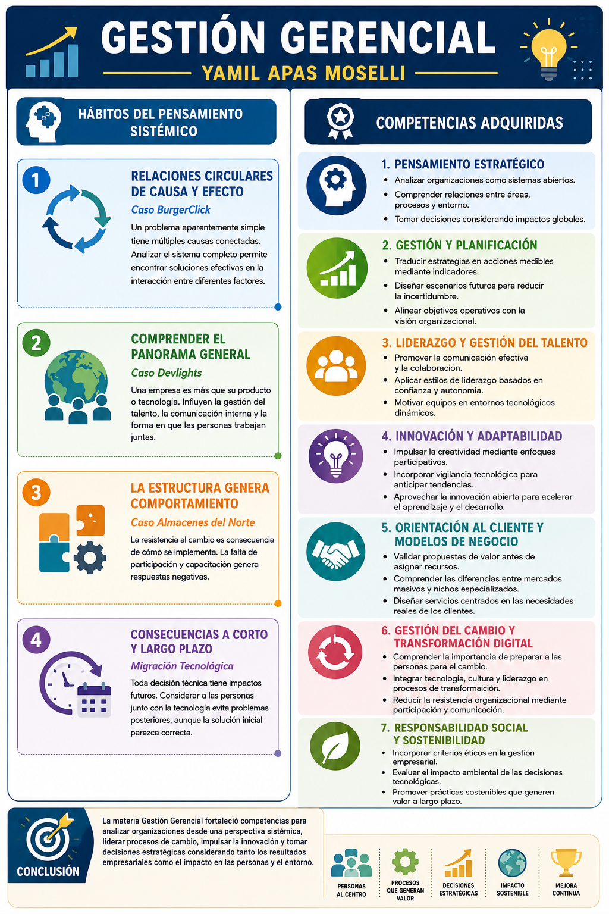
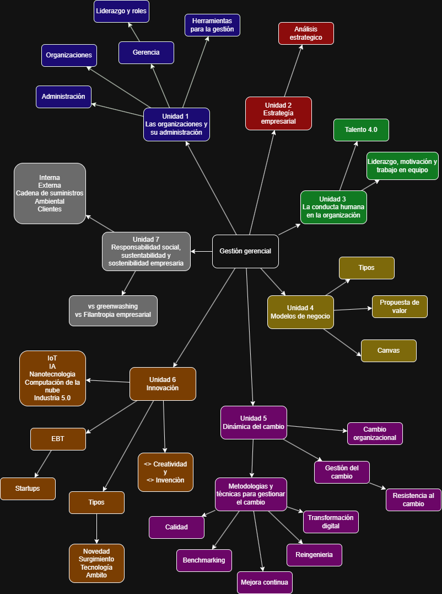

# Ruta Personal de Aprendizaje (RPA)

## Parte A -- Preguntas por Unidad

### Unidad 1 -- Las Organizaciones y su Administración

**Pregunta 1:** ¿Cuáles son las funciones básicas que componen el proceso
administrativo y qué busca cada una?

**Pregunta 2:** ¿Qué habilidades esenciales debe poseer un gerente para 
un desempeño exitoso según la teoría de Katz?

### Unidad 2 -- Estrategia Empresaria

**Pregunta 3:** ¿Qué es el pensamiento estratégico y cuáles son sus claves 
principales?

**Pregunta 4:** ¿En qué consiste el análisis CAME y qué tipos de estrategias 
permite definir?

### Unidad 3 -- La Conducta Humana en la Organización

**Pregunta 5:** ¿Cómo ha evolucionado la forma en que las organizaciones 
lidian con las personas según la gestión del talento?

**Pregunta 6:** ¿Qué importancia tiene la "organización informal" dentro de 
una empresa según la Teoría de las Relaciones Humanas?

### Unidad 4 -- Modelos de Negocios

**Pregunta 7:** ¿Cuáles son los 9 módulos que integran el modelo Canvas para 
diseñar un negocio?

**Pregunta 8:** ¿Qué es una "propuesta de valor" en el contexto de un modelo 
de negocio?

### Unidad 5 -- Dinámica del Cambio

**Pregunta 9:** ¿Cuáles son las tres etapas del cambio organizacional 
propuestas en el modelo de Kurt Lewin?

**Pregunta 10:** ¿Qué objetivos persigue la gestión del cambio dentro de una 
organización?

### Unidad 6 -- Innovación

**Pregunta 11:** ¿Qué define a un "Intrapreneur" o intraemprendedor dentro 
de una organización?

**Pregunta 12:** ¿Cuáles son los principales tipos de innovación que puede 
aplicar una empresa?

### Unidad 7 -- Responsabilidad Social, Sustentabilidad y Sostenibilidad Empresaria

**Pregunta 13:** ¿Cómo se puede evitar que la RSE sea solo una estrategia 
de imagen?

**Pregunta 14:** ¿Qué implica el concepto de “Green IT” para una 
organización tecnológica sustentable?

---

### Hábitos del Pensador Sistémico

#### Identifica la naturaleza circular de relaciones complejas de causa y efecto

Este hábito se trabajó en el Desafío 7 – Diagrama de Ishikawa (Caso BurgerClick). En lugar de ver el problema del delivery frío como un hecho aislado el análisis reveló una red circular de causas: una freidora no calibrada generaba tiempos de cocción irregulares, lo que provocaba demoras que hacían que el repartidor se fuera antes de tiempo al no tener una zona de espera, resultando finalmente en comida fría. El diagrama permitió entender que las soluciones instintivas no habrían resuelto el problema de raíz, ya que las causas se retroalimentaban

#### Reconoce que la estructura de un sistema genera su comportamiento

Este hábito fue clave en el Desafío 6 – Gestión del Cambio (Caso Almacenes del Norte S.A.). El fracaso del nuevo sistema WMS no fue técnico, sino una consecuencia de la estructura organizacional previa. La falta de canales de participación y de capacitación, sumada a la exclusión de líderes informales como Don Roberto, generó un comportamiento de resistencia activa y pasiva. El análisis demostró que cambiar la estructura para incluir a los veteranos como agentes del cambio habría modificado radicalmente su conducta hacia la nueva tecnología.

#### Considera tanto las consecuencias a corto como a largo plazo de las acciones

Se ejemplifica en la actividad sobre el Talento 4.0 proyectado al 2030. Al elegir el rol de "Orquestador de agentes de IA", se analizó cómo, aunque en el corto plazo la automatización puede desplazar ciertos roles técnicos, en el largo plazo surgirá una demanda crítica de capacidades para diseñar y coordinar sistemas autónomos. Tomar decisiones actuales de formación profesional implica considerar cómo estas consecuencias se acumulan y evolucionan con el tiempo frente al avance tecnológico.

#### Busca comprender el panorama general

Este hábito se aplicó en el diseño y programación del Micrositio del equipo (Portfolio). En lugar de tratar la creación del sitio como una serie de tareas de programación aisladas, el enfoque sistémico obligó a pensar en el sistema completo: el flujo de navegación y cómo cada sección individual se integra con las actividades grupales para formar un todo coherente. Ver el proyecto como un sistema funcional completo en lugar de una colección de páginas fue lo que garantizó una entrega bien pensada

---

## Parte B -- Desarrollo de la RPA

### Respuestas a las preguntas

#### Unidad 1

1. ``¿Cuáles son las funciones básicas que componen el proceso administrativo y qué busca cada una?``

El proceso administrativo se compone de cuatro etapas: Planeación (define metas y qué se va a hacer), Organización (ordena recursos y cómo se va a hacer), Dirección (guía al personal y quién lo hace) y Control (evalúa resultados y si se hizo bien).

2. ``¿Qué habilidades esenciales debe poseer un gerente para un desempeño exitoso según la teoría de Katz?``

Todo gerente necesita tres habilidades básicas: Técnica (manejo de procedimientos y conocimientos especializados), Humana (capacidad para trabajar, entender y motivar a las personas) y Conceptual (capacidad de ver la organización como un todo y coordinar sus partes).

#### Unidad 2

3. ``¿Qué es el pensamiento estratégico y cuáles son sus claves principales?``

Es una forma de análisis que busca anticipar escenarios futuros y diseñar acciones para generar ventajas sostenibles. Sus claves incluyen la visión a largo plazo, el análisis del entorno, la creatividad, la toma de decisiones informada y la flexibilidad.

4. ``¿En qué consiste el análisis CAME y qué tipos de estrategias permite definir?``

El CAME es una herramienta que aporta el "cómo" a los objetivos estratégicos derivados del FODA. Permite definir cuatro tipos de estrategias: Ofensivas (fortalezas + oportunidades), Defensivas (fortalezas + amenazas), de Reorientación (debilidades + oportunidades) y de Supervivencia (debilidades + amenazas).

#### Unidad 3

5. ``¿Cómo ha evolucionado la forma en que las organizaciones lidian con las personas según la gestión del talento?``

Ha pasado de ver a las personas como ensambladores estáticos (basado en reglas y control), luego como recursos que deben ser administrados para cumplir objetivos, hasta llegar a verlas como seres humanos proactivos e inteligentes que deben ser impulsados y motivados.

6. ``¿Qué importancia tiene la "organización informal" dentro de una empresa según la Teoría de las Relaciones Humanas?``

Resalta que existen grupos informales dentro de las empresas que influyen significativamente en el comportamiento, la motivación y el rendimiento de los trabajadores, más allá de la estructura jerárquica formal.

#### Unidad 4

7. ``¿Cuáles son los 9 módulos que integran el modelo Canvas para diseñar un negocio?``

Los módulos son: Segmentos de mercado, Propuesta de valor, Canales, Relaciones con clientes, Fuentes de ingreso, Recursos clave, Actividades clave, Asociaciones clave y Estructura de costos.

8. ``¿Qué es una "propuesta de valor" en el contexto de un modelo de negocio?``

Describe el modo en que una empresa crea, proporciona y capta valor, ofreciendo un producto o servicio que soluciona una necesidad específica de un segmento de mercado determinado.

#### Unidad 5

9. ``¿Cuáles son las tres etapas del cambio organizacional propuestas en el modelo de Kurt Lewin?`` 

Las etapas son: Descongelamiento (vencer la resistencia y preparar el terreno), Transición (el proceso de cambio propiamente dicho) y Recongelamiento (implementación exitosa y estabilización del nuevo marco de trabajo).

10. ``¿Qué objetivos persigue la gestión del cambio dentro de una organización?``

Sus objetivos principales son minimizar conflictos, facilitar la adaptación al entorno, mejorar resultados y competitividad, lograr la aceptación del cambio, reducir la incertidumbre y retener el talento.

#### Unidad 6

11. ``¿Qué define a un "Intrapreneur" o intraemprendedor dentro de una organización?``

Es un empleado que actúa como emprendedor dentro de la empresa donde trabaja, impulsando proyectos innovadores utilizando los recursos de la organización.

12. ``¿Cuáles son los principales tipos de innovación que puede aplicar una empresa?``

Existen innovaciones en procesos (mejoras en fabricación), organizacionales (gestión del talento), en productos y servicios, en modelos de negocios y en marketing.

#### Unidad 7

13. ``¿Cómo se puede evitar que la RSE sea solo una estrategia de imagen?``

Integrándola genuinamente en la estrategia de la empresa, de modo que se maximicen beneficios mientras se mantiene un compromiso real con el impacto ético, social y humano de las decisiones.

14. ``¿Qué implica el concepto de “Green IT” para una organización tecnológica sustentable?``

 Implica tomar decisiones concretas en el diseño, infraestructura y operación de los sistemas para asegurar la sustentabilidad y reducir el impacto ambiental desde el área de tecnología.

---

## Reflexión final

Terminando con el cursado de Gestión Gerencial, concluyo que esta ruta de aprendizaje transformó la visión puramente técnica del ingeniero en una perspectiva gerencial sistémica, comprendiendo que la organización es el sistema principal y la tecnología solo uno de sus componentes. 

El proceso de formular preguntas críticas permitió pasar de la memorización al pensamiento estratégico, reconociendo que el éxito de cualquier proyecto depende de la integración  entre estrategia, personas y tecnología.

A través de desafíos prácticos, se consolidaron hábitos del pensador sistémico, como identificar la causalidad circular en problemas operativos y entender que la estructura organizacional genera los comportamientos de resistencia o aceptación. 

En conclusión, la competencia gerencial hoy exige liderar el cambio con visión de largo plazo, gestionando el talento 4.0 bajo marcos de responsabilidad social y ética para generar valor sostenible en entornos inciertos.

---

### Infografía

### Mapa conceptual de la materia

