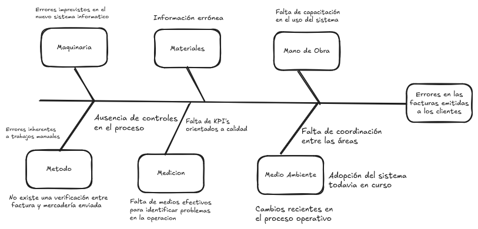

# Problema

La empresa Bagit enfrenta un problema de **errores en la facturación de los pedidos enviados a sus clientes**, situación que ha generado reclamos por parte del 8% de ellos. Los errores identificados se concentran principalmente en tres aspectos: cantidades incorrectas de productos facturados, precios erróneos y facturación de mercadería que finalmente no fue enviada.

Esto resulta especialmente crítico porque afecta directamente la satisfacción del cliente lo que impacta en la imagen de la empresa. Además, los errores parecen haberse manifestado con mayor frecuencia durante los últimos meses, coincidiendo con la implementación de un nuevo sistema informático y con cambios en los procedimientos operativos.

## Causas 

### 1. Máquinaria

* Errores imprevistos en el nuevo sistema informático.

El caso destaca que el sistema fue instalado hace apenas cuatro meses. Como en cualquier adopcion de nuevas tecnologias, van a haber numerosos casos no previstos donde el sistema no soporte la manera de trabajar de la empresa y tenga que ser ajustado, agregando por supuesto los bugs inherentes que todo software presenta.

### 2. Materiales

* Informacion erronea.

Para la operacion de Bagit es crucial tener la informacion correcta acerca de todo lo referico con el stock, los pedidos del cliente y listas de precios actualizadas, entre otras necesidades informaticas. Si esto no se cumple toda la operacion se viene abajo.

### 3. Mano de Obra

* Falta de capacitacion en el uso del sistema.

El caso menciona que se instaló un **nuevo sistema de computación hace cuatro meses** y también que hubo **cambios recientes en los procedimientos**. Si el personal no recibió capacitación suficiente o continúa trabajando con prácticas anteriores, pueden generarse errores en cantidades, precios o productos facturados.

### 4. Método

* No existe una verificacion entre factura y mercaderia enviada.
* Errores inherentes al trabajo manual.

El escenario explica que el flujo de trabajo incluye multiples instancias en donde la factura puede ser modificada, y además advierte que el empaquetado lo realizan los operarios de forma manual, lo que introduce errores inherentes a esta forma de trabajar, los cuales, al no existir una verificacion entre la factura y lo que se envía, pasan desapercibidos.

### 5. Medición

* Falta de medios efectivos para identificar problemas en la operación.
* Falta de controles en el proceso.
* Falta de KPI's orientados a calidad.

El caso indica que *"no había antes una inquietud acerca de la cantidad de quejas"*. Esto sugiere que no existían métricas ni monitoreo adecuados, por lo que los errores podrían haber estado ocurriendo desde hace tiempo sin ser detectados.

### 6. Medio Ambiente

* Adopcion del sistema todavia en curso.
* Falta de coordinacion entre areas.
* Cambios recientes en el proceso operativo.

La empresa estaba realizando esfuerzos para mejorar la calidad y el servicio al cliente, lo que probablemente implicó cambios internos en los procesos operativos, lo que puede haber causado presion en los operarios si fue realizada de forma abrupta, incentivando errores en la operacion, considerando que incluso tienen un sistema nuevo. También, a través del escenario, podemos ver que existe una brecha en la comunicación entre las áreas de facturacion y empaque.

# M más crítica: Máquina

El razonamiento para reconocer que la raíz a atacar es la de **Máquina** es el siguiente: los errores identificados dentro del escenario están directamente relacionados con la información procesada por el sistema, por lo tanto cualquier error en el manejo del mismo impacta directamente sobre todo el proceso operativo, sumado a que el sistema todavía está en un proceso de adopción dentro de la empresa (proceso del cual no sabemos cómo se realizó su inserción) por lo que podemos asumir que los operarios no están del todo familiarizados con su uso.

Además de esto, una inversion para mejorar el sistema puede tratar directamente a los otros problemas reconocidos en **Medición** y **Métodos**, primero implementando trazabilidad en todas las operaciones realizadas por el sistema, generando así información medible, y sirviendo como marco de soporte para las operaciones de la empresa, marcando un camino claro y reduciendo las desviaciones que causan errores.

## Plan de acción

Este plan prioriza la intervención sobre la variable Máquina porque el sistema informático es el punto donde convergen los datos de todas las áreas involucradas. Al mejorar su funcionamiento y su capacidad de trazabilidad, no solo se reducen los errores de facturación, sino que también se fortalecen las dimensiones de Método (procesos más estandarizados) y Medición (información confiable para controlar y mejorar), generando un efecto multiplicador sobre todo el sistema organizacional.

1. Realizar una auditoría integral del sistema informático, analizando cómo se gestionan los datos de pedidos, stock y facturación para detectar posibles errores de configuración, integración o procesamiento.
2. Verificar la sincronización entre los módulos de stock, pedidos y facturación, asegurando que la información utilizada por cada área sea consistente y se actualice en tiempo real.
3. Implementar mecanismos de trazabilidad dentro del sistema, registrando cada modificación realizada sobre pedidos, existencias y facturas para poder identificar el origen de los errores y generar información confiable para su análisis.
4. Establecer controles manuales temporales previos al envío de mercadería, como medida de contingencia mientras se corrigen las causas raíz identificadas en el sistema.
5. Capacitar al personal en el uso del nuevo sistema y en los procedimientos actualizados.
6. Definir indicadores de desempeño y calidad del proceso, realizando un seguimiento semanal de estos indicadores.
7. Documentar y estandarizar los procedimientos operativos utilizando el sistema como soporte principal.

## Comparativa con Gestión Compartida:

| Aspecto | LMLGestion (Lautaro) | Gestion Compartida   |
| ------- | ---------------------  | -------------------- |
| **Problema principal identificado** | El nuevo sistema informático y su adopción generan errores que se propagan a todo el proceso.                                                                      | El proceso carece de controles efectivos para detectar errores antes de llegar al cliente.                                                      |
| **M más crítica**                   | Máquina.                                                                                                                                                           | Medición.                                                                                                                                       |
| **Fundamento principal**            | Existe una correlación temporal entre la implementación del sistema y el aumento de reclamos. El sistema concentra la información de stock, pedidos y facturación. | Independientemente del sistema utilizado, el proceso permite que una factura salga sin validación contra el despacho real.                      |
| **Enfoque de causa raíz**           | Busca corregir la fuente que genera información errónea.                                                                                                           | Busca detectar y bloquear errores antes de que lleguen al cliente.                                                                              |
| **Visión sistémica**                | El sistema es un elemento transversal que impacta en Método, Medición y Mano de Obra.                                                                              | Los controles son el mecanismo que evita que fallas de cualquier origen afecten al cliente.                                                     |
| **Horizonte de resultados**         | Más largo plazo, requiere análisis y posibles modificaciones del sistema.                                                                                          | Más corto plazo, puede implementarse rápidamente mediante cambios de procedimiento.                                                             |
| **Riesgo principal**                | Si el problema no está en el sistema, la inversión puede no resolver completamente los errores.                                                                    | Si el problema está en los datos o en el software, los controles podrían transformarse en soluciones reactivas que aumentan la carga operativa. |
| **Beneficio principal**             | Elimina potencialmente el origen de los errores y genera información para mejorar continuamente.                                                                   | Reduce inmediatamente la probabilidad de que un error llegue al cliente.                                                                        |

## Escenario TPI

La cabeza del pescado corresponde al problema organizacional: **Alta cantidad de errores operativos y defectos en producción.**

Este no es un síntoma sino un problema organizacional medible, ya que puede cuantificarse mediante indicadores como porcentaje de perfiles defectuosos, cantidad de reprocesos, desperdicio de material, errores en los registros de producción y productividad por línea de trabajo.

### Mapeo de las 6M

### 1. Sistemas e Información

La empresa carece de información oportuna para detectar desviaciones antes de que generen pérdidas significativas. Además, al trabajar con planillas de Excel y sistemas fragmentados, la información suele encontrarse desactualizada, duplicada o incompleta, dificultando la toma de decisiones basada en datos.

### 2. Procesos

Existen procesos que dependen excesivamente de la experiencia individual de los operarios y no de procedimientos formalizados. Esto conlleva que el proceso se vuelva algo subjetivo por cada empleado e introduciendo errores.

### 3. Tecnología

La tecnología actual no acompaña adecuadamente la operación y obliga a los empleados a realizar tareas manuales de registro y control que incrementan la posibilidad de errores. Sin embargo, la tecnología aparece en el análisis más como una consecuencia de la falta de formalización organizacional que como la causa primaria del problema.

#### Conclusión

La M más crítica es Métodos. La empresa creció rápidamente sin formalizar procedimientos ni definir estándares de trabajo consistentes. Como consecuencia, la capacitación se realiza informalmente, los controles son principalmente correctivos y cada sector desarrolla prácticas propias. La propuesta de mejora busca atacar esta causa raíz mediante la formalización del organigrama, la documentación de procedimientos operativos, la definición de criterios de calidad y la implementación de mecanismos de retroalimentación estructurados.

