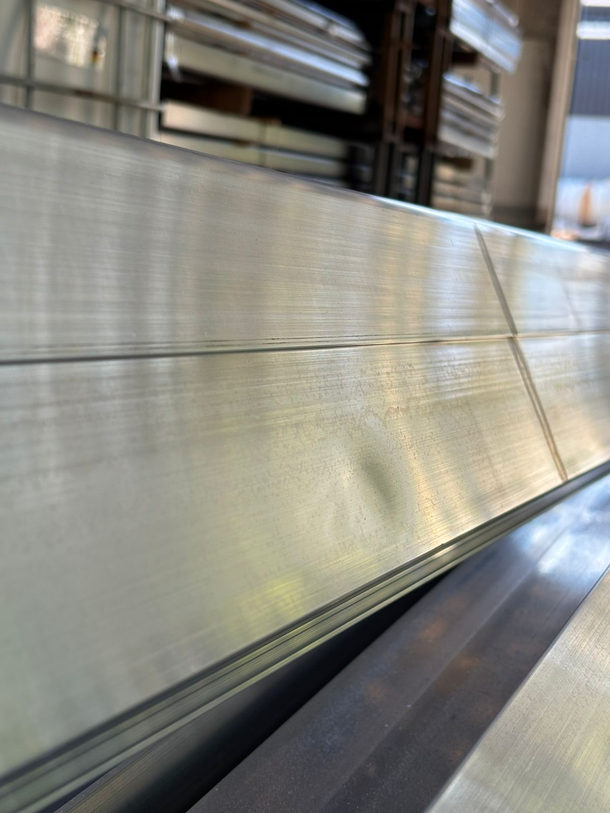
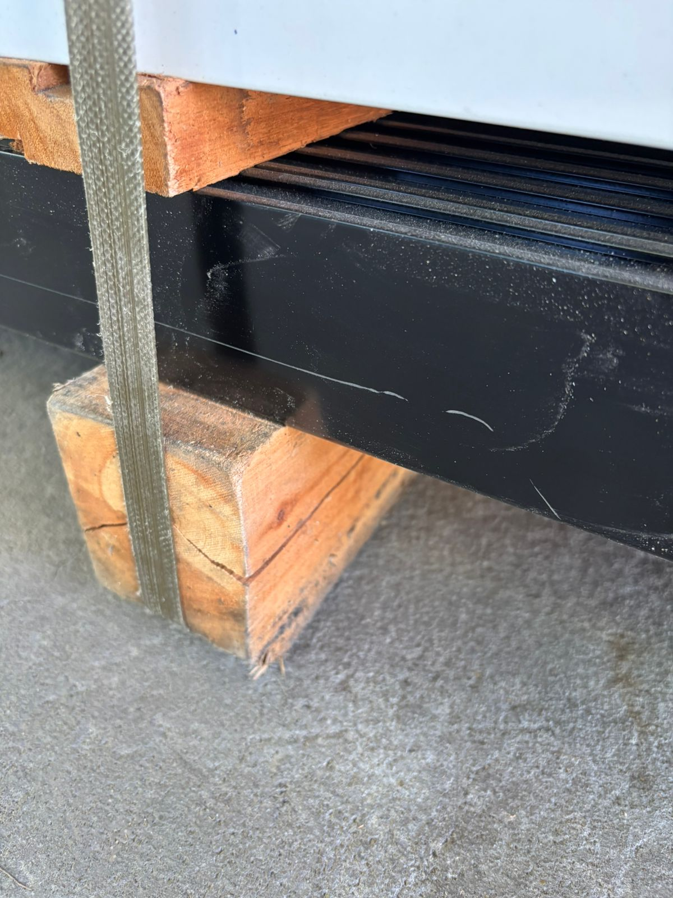
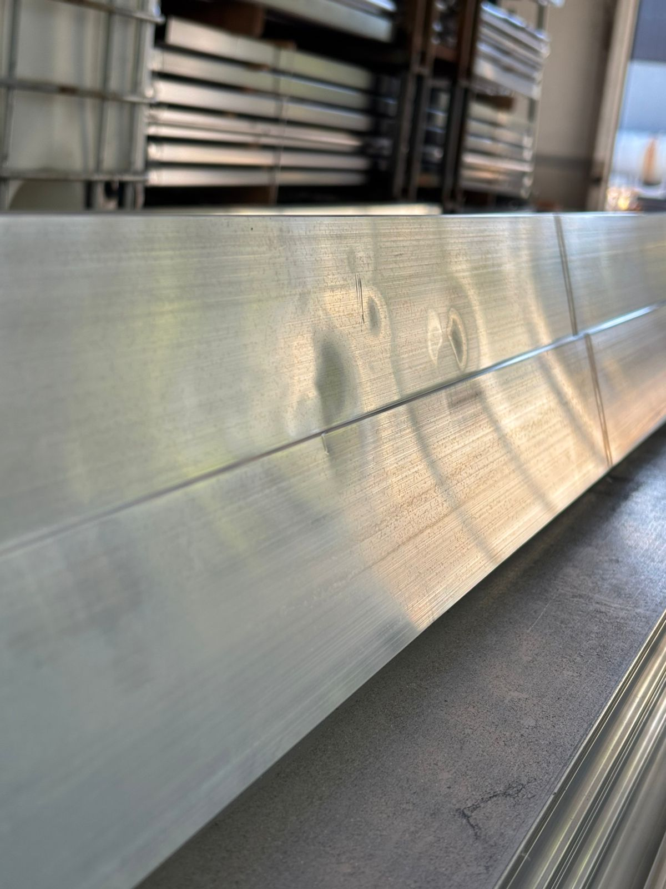
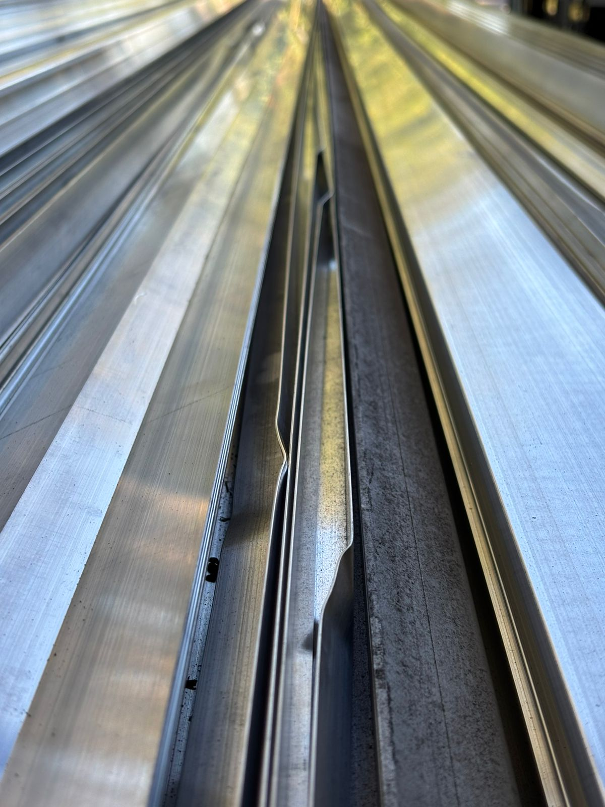

## Información general del proyecto

El presente trabajo fue elaborado por el equipo LML Gestión en el marco de la cátedra de Gestión Gerencial, con el objetivo de documentar la realización de un diagnóstico organizacional que concluye con la identificación de una problemática, la cual se busca mitigar con la propuesta de un plan de trabajo.

La organización analizada es Eseica NEA S.R.L., empresa radicada en Corrientes con actividad en el rubro de la construcción en seco. Sus operaciones se dividen en dos unidades principales: la comercialización de materiales para construcción en seco y el tratamiento superficial de perfiles de aluminio mediante procesos de pintura y anodizado. Cuenta con plantas productivas en Corrientes y Puerto Tirol, y sucursales comerciales en Resistencia, Formosa, Posadas y Sáenz Peña, sumando un total de seis puntos de presencia en la región del NEA y aproximadamente 180 empleados.

El objetivo general del diagnóstico es analizar la situación actual de la empresa para identificar sus principales problemas organizacionales y proponer mejoras que contribuyan a optimizar su funcionamiento. Para ello, el equipo realizó entrevistas con el Gerente del Área de Producción y complementó la información con observación directa in situ, aplicando herramientas de análisis estratégico como el FODA, las 5 Fuerzas de Porter, el análisis PESTA y el modelo Canvas, entre otras.

El informe que sigue desarrolla en detalle los resultados de ese análisis, la descripción del problema organizacional seleccionado y la propuesta de solución correspondiente.

## Diagnóstico de la organización

### 1. Datos Generales

---

| Campo                    | Detalle                                                                           |
| ------------------------ | --------------------------------------------------------------------------------- |
| **Nombre**               | Eseica NEA S.R.L                                                                  |
| **Rubro**                | Construcción                                                                      |
| **Domicilio**            | Ruta 5 KM 43                                                                      |
| **Localidad**            | Corrientes                                                                        |
| **Provincia**            | Corrientes                                                                        |
| **Tamaño**               | No sabemos con precisión. Pero cuenta con 6 sucursales.                           |
| **Equipo responsable**   | LML Gestión                                                                       |
| **Fecha de elaboración** | 27/03/2026                                                                        |
| **Descripción general**  | Compra y venta de materiales de construcción y producción de perfiles de aluminio |

### 2. Objetivo del Diagnóstico

---

#### Objetivo General

Analizar la situación actual de la empresa para identificar problemas organizacionales y proponer mejoras que contribuyan a optimizar su funcionamiento.

#### Objetivos Específicos

- Evaluar la estructura organizacional
- Analizar la gestión gerencial
- Examinar los procesos administrativos
- Evaluar la comunicación interna
- Analizar el uso de tecnología y sistemas de información
- Detectar fortalezas y debilidades
- Proponer recomendaciones

### 3. Metodología Utilizada

---

- **Técnicas de recolección de información:** Entrevistas y Observación
- **Fuentes consultadas:** Gerente Área Producción (Sebastián Fidanza)
- **Período de análisis:** Entrevista: 08/04/2026
- **Herramientas de gestión aplicadas:** No hacen uso de herramientas para describir o analizar la organización. Solo usan Excel para gestionar la evolución de la producción.

### 4. Análisis de la Organización

---

#### 4.1 Descripción de la Organización

##### Estructura Organizacional

- **Productiva:** plantas en Puerto Tirol y Corrientes (carpintería de aluminio mediante procesos de pintura y anodizado).
- **Comercial:** gestión de ventas y atención al cliente en múltiples sedes (Resistencia, Formosa, Posadas, Sáenz Peña).
- **Administrativa y Compras:** soporte operativo y relación con proveedores.
- **Recursos Humanos:** Gestión del personal.

##### Organigrama

**Áreas o departamentos:** Área productiva - área comercial - área de RR. HH. (staff del encargado comercial) - Área de administración.

##### Funciones Principales

- Tratamiento superficial de perfiles de aluminio en tratamientos de pintura y anodizado.

##### Cultura y Clima Organizacional

Se observa una cultura orientada a la producción y la expansión territorial, pero con un clima organizacional tenso. Existe una brecha de confianza entre la gerencia y el nivel operativo, lo que sugiere una cultura de control más que de compromiso.

##### Misión

> _"Organización empresa/familia, comprometida con la innovación, desarrollo e implementación de sistemas constructivos eficientes. Respondiendo de forma rápida y sensible a los constantes cambios. Líder en satisfacción de clientes con fuerte expansión territorial."_

##### Visión

> _"Ser la empresa de vanguardia en sistemas constructivos, reconocida por la calidad humana y profesionalidad de los integrantes. Con incorporación de procesos industriales, que potencien la inversión local, generen puestos de trabajo, agreguen tecnología a la región y den flexibilidad a los proyectos."_

##### Objetivo

Comercialización de materiales de construcción, específicamente todo lo necesario para fabricar carpinterías de aluminio.

##### Gestión Gerencial

El estilo de conducción es autoritario y centralizado. La alta gerencia concentra la toma de decisiones estratégicas, mientras que los niveles operativos se limitan principalmente a la ejecución de tareas. Existe un nivel de control medio, basado en la supervisión de resultados a través de reuniones semanales, más que en el seguimiento directo de las actividades.

En cuanto a la delegación, se observa que ocurre principalmente de manera horizontal dentro de los mismos niveles jerárquicos, especialmente en la gerencia media, lo que permite cierta coordinación operativa pero sin implicar una descentralización real del poder de decisión.

##### Recursos Humanos

- **Cantidad de empleados:** aproximadamente 100 empleados en la casa central (Corrientes) y 50 en la sucursal de producción (Puerto Tirol). Se cuenta con un estimado de 30 personas en las demás sucursales de venta (Resistencia, Posadas, Formosa, Sáenz Peña).
- **Capacitación:** en la selección de RRHH se buscan empleados con los conocimientos técnicos específicos, sin tener en cuenta habilidades blandas. No se hacen capacitaciones generales, se capacita a los empleados sobre la marcha según las necesidades que surjan.
- **Motivación:** el único incentivo es el sueldo en blanco. No existen otros incentivos o premios por buen desempeño.
- **Clima laboral:** discrepancias entre el nivel operativo y la gerencia. El gerente no confía en los empleados de nivel operativo porque cree que no se comprometen lo suficiente con la empresa.
- **Rotación de personal:** Baja.

##### Procesos Administrativos

- **Planificación:** Reuniones trimestrales. Planificación de campañas de producción de perfiles de aluminio de determinados tratamientos en conjunto con tratamientos a pedido. Se planifica en un calendario la cantidad de material a producir en un plazo determinado.
- **Organización:** departamentalización funcional con jefes de planta responsables del cumplimiento de cuotas.
- **Dirección:** supervisión directa por parte de los jefes de planta (gerencia de primera línea).
- **Control:** reuniones semanales para la toma de decisiones correctivas en los procesos y visualización de KPIs.

##### Comunicación Organizacional

- Informal
- Vertical
- Reuniones semanales

##### Sistemas de Información y Tecnología

- **Uso de internet:** poseen conectividad a internet en cada área de la empresa (plantas de producción, área de ventas, área de compras, laboratorio, oficinas de la gerencia) con una red distinta.
- **Automatización:** Se encuentra en pleno proceso de transformación y digitalización de los procesos operativos clave del área de producción. El registro de perfiles de aluminio tratados, pedidos, órdenes de compra y remitos se realiza de manera digital.
- **Seguridad:** la empresa cuenta con VPS y VPN, firewall y un software de gestión de credenciales (Winbox), administrado por el encargado de los procesos informáticos (actualmente el mismo gerente de producción). No existe un encargado de la seguridad de la información, los operarios se pasan la información que poseen entre ellos.
- **Sistemas de Información:** TANGO Gestión, Eseica intranet (dividida en 2 sistemas distintos), Access, Excel, Winbox, Sistema de gestión de ventas.
- **Redes:** VPN, VPS.
- **Resultado del chequeo digital:** están en plena transformación digital (ver Anexo 2).

#### 4.2 Descripción del Entorno de la Organización

##### Macroentorno — PESTA

| PESTA             | Factor                                 | Oportunidad                                                                                                                                              | Amenaza                                                                                                                                                            |
| ----------------- | -------------------------------------- | -------------------------------------------------------------------------------------------------------------------------------------------------------- | ------------------------------------------------------------------------------------------------------------------------------------------------------------------ |
| **Político**      | Factores políticos                     | Apertura de importaciones y políticas de libre mercado facilitan el acceso a maquinaria, insumos y tecnologías industriales importadas a menores costos. | Políticas que favorezcan la importación inciden negativamente en la posición comercial de la empresa.                                                              |
| **Económico**     | Tasa de inflación                      | —                                                                                                                                                        | El aumento de la tasa de inflación puede generar un desbalance en las ganancias si no se ajustan los precios de manera acorde.                                     |
| **Económico**     | Tipo de cambio                         | —                                                                                                                                                        | El tipo de cambio desfavorece a la organización; cuentan con un fuerte proveedor en Paraguay, lo que implica considerar el impuesto a la importación en Argentina. |
| **Sociocultural** | Crecimiento poblacional                | El crecimiento poblacional y los altos costos de la construcción tradicional llevan a las nuevas generaciones a optar por la construcción en seco.       | —                                                                                                                                                                  |
| **Tecnológico**   | Tasa de innovación                     | El crecimiento en la instalación de paneles solares permite reducir costos operativos y aprovechar la independencia energética.                          | —                                                                                                                                                                  |
| **Tecnológico**   | Procesos automatizados en la industria | Oferta de robots industriales para automatización de producción.                                                                                         | —                                                                                                                                                                  |

##### Ramo del Negocio — 5 Fuerzas de Porter

**1. Rivalidad entre competidores existentes**

La rivalidad entre competidores existentes es alta, existen múltiples empresas en la región que ofrecen tanto venta de aberturas de aluminio como materiales de construcción en seco.

**2. Amenaza de nuevos competidores entrantes**

La amenaza de nuevos competidores es baja porque entrar en el negocio de perfiles de aluminio requiere una gran inversión inicial, que incluye entre otros: línea de pintura electrostática, túnel de pretratamiento químico, cabina de aplicación con pistolas electrostáticas automáticas, sistema de reciclaje, horno de curado, cadena transportadora aérea continua, línea de anodizado, sistema de refrigeración, planta de tratamiento de efluentes, galpón industrial y acometida eléctrica de media tensión.

**3. Poder de negociación de los proveedores**

El poder de negociación de los proveedores es alto, ya que no existen múltiples proveedores de aluminio en la zona, lo que sujeta a la empresa a mantener a sus proveedores, dándoles el poder de regular los costos en un mercado cuasi-monopólico.

Proveedores actuales: Metales del Talar y Alukler (aluminio), Durlock y Retak (construcción en seco), Llana (herramientas).

**4. Poder de negociación de los clientes**

El poder de negociación de los clientes es alto porque tienen muchas alternativas que ofrecen productos y servicios similares a Eseica, incluyendo productos sustitutos.

**5. Amenaza de productos sustitutos**

La amenaza es alta por la presencia de múltiples productos que cumplen las mismas funciones: perfiles de madera, perfiles de PVC, materiales de construcción en húmedo y placas de fibrocemento.

#### 4.3 Modelo de Negocios (CANVAS)

### 5. Análisis de la Situación Actual

---

#### 5.1 Fortalezas

- La empresa posee una sólida presencia en la región del NEA con seis sucursales estratégicas (Corrientes, Resistencia, Formosa, Posadas, Puerto Tirol y Sáenz Peña), lo que le otorga una ventaja competitiva de escala frente a competidores locales más pequeños.
- Eseica cuenta con el capital necesario para financiar desarrollos tecnológicos a medida y ha iniciado procesos de digitalización en áreas clave como producción y ventas.
- El control sobre procesos críticos, como el tratamiento superficial de aluminio (pintura y anodizado) que antes se tercerizaba, permite capturar un mayor margen de valor y reducir la dependencia de proveedores externos de servicios.
- Todo el material residual de la producción se devuelve a los proveedores generando una comisión para la empresa, reduciendo costos.

#### 5.2 Debilidades

- Los sistemas internos son incompetentes en relación con el volumen de información, además de que esta está dispersa, lo que dificulta la toma de decisiones informadas debido al difícil acceso a la misma.
- No tienen los medios a través de los cuales obtener información en tiempo real del funcionamiento de las plantas.
- La falta de automatización genera cuellos de botella en la operación diaria y aumenta el margen de error humano.
- Los operarios no están comprometidos con su trabajo, se registran constantemente desatenciones que llevan a errores en la producción.
- Alta dependencia de la supervisión directa de los socios gerentes y falta de protocolos operativos estandarizados.

#### 5.3 Oportunidades

- El auge de la construcción en seco y cerramientos de aluminio presenta un mercado en expansión donde Eseica ya tiene posicionamiento y unidades de negocio activas.
- La creciente oferta de robots industriales y tecnologías de automatización brinda la posibilidad de optimizar la producción, reducir errores operativos y aumentar la eficiencia.
- La apertura de importaciones y las políticas de libre mercado facilitan el acceso a maquinaria, insumos y tecnologías industriales importadas a menores costos, permitiendo modernizar procesos y aumentar la competitividad.
- La incorporación de paneles solares representa una oportunidad para reducir costos energéticos en los procesos industriales y mejorar la sostenibilidad de la empresa.

#### 5.4 Amenazas

- La alta dependencia de proveedores puede generar problemas en la producción.
- Las políticas de apertura de importaciones facilitan el ingreso de productos extranjeros a menor costo, incrementando la competencia y reduciendo la competitividad de la producción local.
- El aumento de la inflación puede generar desequilibrios financieros si los precios de venta no logran ajustarse al mismo ritmo que los costos operativos y de producción.
- El tipo de cambio desfavorece a la organización por su dependencia de un proveedor en Paraguay, lo que implica considerar el impuesto a la importación en Argentina.
- La alta rivalidad entre competidores del sector, con numerosas empresas en el NEA que ofrecen productos y servicios similares.
- La presencia de productos sustitutos como aberturas de PVC, madera, hierro y otros sistemas constructivos en el mercado regional y nacional.

### 6. Descripción del Problema

---

#### 6.1 Enunciar los Problemas Organizacionales

| Clasificación                            | Problemas detectados                                                                                                                                                                                                                                                                                                       |
| ---------------------------------------- | -------------------------------------------------------------------------------------------------------------------------------------------------------------------------------------------------------------------------------------------------------------------------------------------------------------------------- |
| **Estructura Organizacional**            | Carecen de un organigrama de uso común para toda la empresa. En la práctica no usan el organigrama, y está desactualizado.                                                                                                                                                                                                 |
| **Gestión Gerencial**                    | No tienen acceso a información en tiempo real para la toma de decisiones rápidas y de manera oportuna. Por ello, están limitados a tomar medidas correctivas antes que preventivas.                                                                                                                                        |
| **Recursos Humanos**                     | Los operarios de producción cometen una gran cantidad de errores en sus tareas diarias, produciendo perfiles de aluminio con defectos frecuentemente y registrando erróneamente información referida a la producción.                                                                                                      |
| **Proceso Administrativo**               | El proceso administrativo sobre las operaciones de la empresa está guiado por reuniones semanales donde se reconocen problemas que ocurrieron durante la semana. Esto vuelve imposible la capacidad de tomar medidas preventivas frente a todos los problemas que pueden ocurrir, debido a que falta información oportuna. |
| **Comunicación Organizacional**          | Solamente cuentan con reuniones semanales y presenciales, lo que impide la respuesta rápida a cualquier incidente. Reuniones trimestrales entre los gerentes de cada sucursal.                                                                                                                                             |
| **Sistema de Información y Tecnologías** | El sistema de Tango Gestión resulta difícil de extender para las necesidades de información que tienen. Los desarrollos in-house resultantes aumentan la complejidad operativa y segregan los datos, generando problemas de datos inaccesibles, duplicados y desactualizados.                                              |
| **Modelo de Negocio**                    | Dependencia en proveedores para completar los ciclos de producción.                                                                                                                                                                                                                                                        |

#### 6.2 Seleccionar dos Problemas

##### Problema 1: Alta cantidad de errores operativos y defectos en producción

- **Descripción:** Los operarios de producción cometen gran cantidad de errores en sus tareas diarias, produciendo perfiles con defectos frecuentemente y registrando erróneamente información referida a la producción. Existe una profunda desconexión y desconfianza entre la gerencia y el nivel operativo, lo que se traduce en una falta de compromiso del personal, desatenciones recurrentes, un alto índice de perfiles de aluminio con defectos y registros de datos manuales o erróneos. La dirección responde con un estilo autoritario y control centralizado, pero carece de visibilidad en tiempo real de la producción.

- **Causas:**
  - Ausencia de un sistema unificado de ejecución de manufactura (MES) conectado al ERP.
  - En lugar de motivar a los operarios, la dirección se limita a asignar tareas y realizar llamados de atención a las estaciones de trabajo que cometan errores.
  - Capacitación deficiente o "sobre la marcha", enfocada únicamente en lo técnico y omitiendo habilidades blandas y concientización sobre la calidad.
  - Políticas de incentivos inexistentes; el sueldo es el único motivador, lo que elimina el estímulo por el trabajo bien hecho.

- **Efectos:**
  - Altos costos por desperdicio de material y reprocesamiento de perfiles de aluminio defectuosos.
  - Datos duplicados, desactualizados o directamente falsos en planillas de Excel y sistemas fragmentados.
  - Clima laboral tenso, estancamiento de la productividad y resistencia implícita del personal hacia las directivas de la gerencia.

- **Factores que afectan al problema:**
  - Los gerentes comerciales e industriales tienen visiones y organigramas distintos y desconectados.
  - La empresa tiene el capital para financiar tecnología, pero carece del liderazgo para gestionar el cambio cultural que esa tecnología requiere.

##### Problema 2: Falta de integración de la información para la gestión gerencial

- **Descripción:** El crecimiento sostenido de la empresa no fue acompañado por una evolución equivalente de sus mecanismos de gestión y control. La información necesaria para la toma de decisiones se encuentra distribuida en múltiples sistemas independientes (Tango Gestión, intranets, Access, Excel y Winbox), generando inconsistencias, duplicación de datos y dificultades para acceder a información confiable y actualizada. Esta fragmentación limita la visibilidad de los procesos operativos y obliga a la gerencia a basar gran parte de sus decisiones en reuniones periódicas y análisis retrospectivos, adoptando un enfoque predominantemente reactivo.

- **Causas:**
  - Crecimiento exponencial de la organización de forma orgánica y familiar, sin una planificación de arquitectura empresarial o TI.
  - Centralización técnica: el mismo gerente de producción administra la infraestructura informática y la seguridad, actuando como un cuello de botella operativo.
  - Inflexibilidad o mala implementación del sistema ERP (Tango Gestión) para adaptarse a las necesidades específicas del área industrial.

- **Efectos:**
  - Vulnerabilidad crítica en la seguridad de la información por la transmisión informal de datos entre operarios y la falta de un responsable formal del área.
  - Lentitud en la respuesta comercial y operativa ante las demandas del mercado o fallas en el suministro.
  - Toma de decisiones ejecutivas a ciegas o basadas en datos históricos desfasados, incrementando el riesgo ante amenazas del entorno como la inflación o la competencia.

- **Factores que afectan al problema:**
  - La estructura geográfica dispersa (seis sucursales) incrementa la complejidad de la sincronización de datos si no existe una plataforma en la nube centralizada.
  - Resistencia de la alta gerencia a delegar la toma de decisiones y la administración de los sistemas por falta de profesionales dedicados en TI.

#### 6.3 Problema a Resolver

El problema seleccionado es el **Problema 1: Alta cantidad de errores operativos y defectos en producción**.

A continuación se identifican los factores que afectan al problema con el diagrama causa-efecto de Ishikawa. El diagrama de actividades UML del proceso de negocio se encuentra en el Anexo 7.

| Factor                        | Causas                                                                                                                                          |
| ----------------------------- | ----------------------------------------------------------------------------------------------------------------------------------------------- |
| **Personas**                  | Capacitación únicamente "sobre la marcha". Falta de compromiso del personal. Desconfianza entre operarios y gerencia.                           |
| **Métodos**                   | Ausencia de procedimientos estandarizados. Gestión basada en llamados de atención en lugar de prevención. Controles principalmente correctivos. |
| **Sistemas**                  | Ausencia de un sistema MES integrado al ERP. Sistemas fragmentados y planillas Excel. Falta de información en tiempo real.                      |
| **Gestión**                   | Estilo de conducción autoritario y centralizado. Escasa delegación de decisiones. Falta de liderazgo para gestionar el cambio cultural.         |
| **Motivación**                | El sueldo es el único incentivo. No existen premios por desempeño. Escaso reconocimiento al trabajo bien realizado.                             |
| **Estructura organizacional** | Organigramas distintos según cada gerente. Roles y responsabilidades poco claras.                                                               |

### 7. Conclusión del Diagnóstico

---

Eseica NEA presenta una crisis de crecimiento derivada de su transición de empresa familiar a organización de gran escala sin haber pasado primero por un proceso de formalización y estandarización de actividades. El crecimiento exponencial de la empresa no fue acompañado por una estructura organizacional formal, lo que lleva a que los roles no estén definidos claramente. Los empleados no son adecuadamente capacitados y no tienen compromiso con la empresa. Además, la comunicación es principalmente verbal e informal, la información se distribuye a los empleados semanalmente en reuniones, lo que impide la ejecución de acciones preventivas. Por último, los sistemas son islas de información que resultan en datos duplicados y desactualizados.

## Plan de Trabajo

### Datos del Equipo de Trabajo

| Nombre                   | DNI      | Legajo UTN |
| ------------------------ | -------- | ---------- |
| Acosta Quintana, Lautaro | 44293823 | 26587      |
| Faccini, Lautaro         | 44463715 | 26835      |
| Fidanza, Felipe          | 44196164 | 26625      |
| Moselli, Yamil           | 44222014 | 25458      |
| Stegmayer, Tobias        | 43617073 | 26730      |

### Título del Proyecto

Optimización de la calidad y eficiencia en la producción de perfiles

### Descripción del Proyecto

Nuestra propuesta de solución busca mejorar la calidad de los perfiles producidos y reducir los errores operativos mediante una combinación de cambios organizacionales, capacitación del personal e incorporación de tecnología.

En una primera etapa, se propone fortalecer la estructura organizacional mediante la unificación del organigrama, la definición formal de roles y la documentación de procedimientos de trabajo. Además, se realizarán capacitaciones orientadas a la calidad y se implementará un protocolo de feedback para reemplazar los llamados de atención por mecanismos de mejora continua. El objetivo es establecer una base organizativa sólida y alinear a todo el personal con estándares comunes de trabajo.

En una segunda etapa, se incorporarán mecanismos para aumentar el compromiso y la participación de los empleados. Para ello se implementará un sistema de incentivos vinculado a la calidad de producción, acompañado por tableros de resultados visibles para los equipos de trabajo. También se crearán espacios periódicos donde los operarios puedan proponer mejoras y participar activamente en la optimización de los procesos productivos.

Finalmente, en una tercera etapa, se avanzará en la incorporación de un sistema MES (Manufacturing Execution System) integrado con las herramientas actuales de gestión. Este sistema permitirá registrar información en tiempo real, mejorar la trazabilidad de la producción, detectar desvíos de manera temprana y reducir la dependencia de registros manuales y planillas dispersas. De esta manera, la organización podrá pasar de una gestión principalmente reactiva a una gestión preventiva basada en información confiable y oportuna.

En conjunto, estas acciones permitirán reducir la cantidad de defectos en producción, mejorar la calidad de la información disponible para la toma de decisiones, fortalecer el compromiso del personal y aumentar la eficiencia operativa de la empresa.

### Integración con la Propuesta de Valor de Eseica

La propuesta de valor de Eseica NEA es: _"Impulsar la modernización de la construcción en el NEA mediante sistemas constructivos innovadores, materiales de alta calidad y soluciones listas para instalar, con disponibilidad inmediata y respaldo técnico especializado."_

La solución se integra directamente con esta propuesta de valor, ya que busca fortalecer los atributos que diferencian a la empresa en el mercado: la calidad, la innovación y la confiabilidad de sus productos y servicios.

La formalización de procesos, la capacitación del personal y la implementación de mecanismos de control de calidad permitirán reducir errores y defectos en la producción, garantizando materiales de mayor calidad para los clientes. La incorporación de un sistema MES y la digitalización de la información productiva refuerzan el compromiso de la empresa con la innovación. Finalmente, el fortalecimiento de la participación de los empleados y la mejora de la comunicación interna contribuirán a generar una organización más eficiente y comprometida, capaz de brindar un mejor respaldo técnico.

### Integración con la Estrategia del Negocio

El problema organizacional seleccionado se encuentra estrechamente vinculado con los procesos centrales de la empresa, ya que la falta de capacitación formal, la ausencia de procedimientos estandarizados y la limitada integración entre la gerencia y el nivel operativo impactan directamente en la calidad de los productos y en la eficiencia de las operaciones productivas.

Esta situación afecta la capacidad de la organización para sostener su estrategia de crecimiento y consolidación en el mercado. La expansión territorial, la incorporación de nuevas líneas de negocio y la mejora continua de los procesos requieren personal capacitado, comprometido y alineado con los objetivos organizacionales.

En este contexto, la propuesta de solución contribuye al fortalecimiento de las capacidades organizacionales necesarias para acompañar el crecimiento de la empresa, mediante la formalización de procesos, el desarrollo del capital humano, la mejora de la comunicación interna y la incorporación de herramientas tecnológicas que favorezcan una gestión más eficiente.

### Propuesta de Herramientas de Gestión Gerencial

- **Cuadro de Mando Integral (Balanced Scorecard):** permite traducir los objetivos estratégicos de la organización en indicadores medibles relacionados con producción, clientes, procesos internos y aprendizaje organizacional. Facilitaría el seguimiento del desempeño de las distintas sucursales y áreas de negocio mediante métricas alineadas con la estrategia empresarial.
- **Inteligencia Artificial para análisis y predicción:** se propone incorporar la herramienta de inteligencia artificial Claude localmente para analizar los datos generados por producción, ventas y logística, a través de las extensiones que dicha herramienta ofrece.

### Cambios Factibles

- Formalización del organigrama y definición de roles.
- Elaboración de procedimientos estandarizados.
- Capacitación periódica del personal.
- Implementación de protocolos de feedback.
- Creación de tableros de indicadores de desempeño.
- Programas de incentivos vinculados a la calidad.

### Cambios Deseables

- Implementación de un sistema MES integrado al ERP.
- Centralización de la información corporativa.
- Incorporación de herramientas de Inteligencia Artificial para análisis predictivo.
- Profesionalización de la gestión de tecnologías y seguridad de la información mediante un área especializada.

### Ventaja Competitiva que Generaron los Cambios

- Reducción de defectos y reprocesos en producción.
- Mayor calidad y uniformidad en los productos ofrecidos.
- Información confiable y disponible en tiempo real para la toma de decisiones.
- Mayor capacidad de respuesta frente a cambios en la demanda o problemas operativos.
- Incremento de la productividad y eficiencia de las plantas.
- Fortalecimiento del compromiso y participación de los empleados.
- Mejora de la experiencia del cliente mediante entregas más confiables y productos de mayor calidad.
- Consolidación de la estrategia de crecimiento y expansión territorial de la empresa.

### Modelado del Proceso Futuro con BPMS

El modelado del proceso futuro en BPMS (Anexo 8) se realiza a partir del proceso "Realizar tratamiento de material de aluminio", apuntando a las mejoras a través de la integración del sistema MES. El sistema permitirá registrar información en tiempo real, mejorar la trazabilidad de la producción, detectar desvíos de manera temprana y reducir la dependencia de registros manuales y planillas dispersas. En cada subetapa del proceso es preciso registrar todos los eventos que acontecen, tanto de material tratado correctamente como material golpeado o defectuoso, indicando el motivo y observaciones.

### Objetivos del Proyecto

1. Diseñar e implementar un organigrama formal y procedimientos estandarizados para el 100% de los puestos operativos críticos de producción dentro de los primeros 3 meses del proyecto.
2. Capacitar al 100% de los operarios y supervisores de planta en procedimientos operativos y criterios de calidad en los primeros 6 meses del proyecto.
3. Reducir en un 30% la cantidad de perfiles defectuosos y reprocesos registrados en las líneas de producción dentro de los 12 meses posteriores al inicio de la implementación.
4. Implementar un sistema MES integrado a los procesos productivos que permita registrar y visualizar información operativa en tiempo real para al menos el 90% de las órdenes de producción en los próximos 12 meses.

### Tiempo Estimado de Duración del Proyecto

- **Semana laboral:** Lunes a viernes, 4 horas diarias
- **Duración total:** 448 hs

### Cronograma de Actividades

| Etapa                                  | Tarea                                                | Horas  | Resultados Esperados                                                              |
| -------------------------------------- | ---------------------------------------------------- | ------ | --------------------------------------------------------------------------------- |
| **Fase 1: Estructura y formalización** | Unificación del organigrama                          | 16 hs  | Organigrama formal actualizado y distribuido en todas las sucursales              |
|                                        | Elaboración de manuales de procedimientos por puesto | 36 hs  | Procedimientos documentados y estandarizados para tareas críticas                 |
|                                        | Taller de concientización sobre calidad              | 8 hs   | Personal sensibilizado sobre el impacto de errores y defectos                     |
|                                        | Diseño e implementación del protocolo de feedback    | 20 hs  | Nuevo esquema de comunicación y corrección de errores aplicado por supervisores   |
| **Fase 2: Incentivos y participación** | Diseño del programa de bono colectivo por calidad    | 12 hs  | Sistema de incentivos definido y listo para prueba piloto                         |
|                                        | Implementación de tablero de resultados en planta    | 28 hs  | Indicadores de calidad visibles para los operarios                                |
|                                        | Creación del espacio mensual de mejora continua      | 8 hs   | Canal formal de participación y propuestas de mejora implementado                 |
| **Fase 3: Sistema MES**                | Relevamiento y selección de solución MES             | 40 hs  | Sistema MES seleccionado y plan de implementación definido                        |
|                                        | Implementación piloto y despliegue del MES           | 112 hs | Registro automatizado, trazabilidad de producción e información en tiempo real    |
|                                        | Pruebas y verificaciones de funcionamiento del MES   | 168 hs | Sistema MES funcionando correctamente en base a las funcionalidades especificadas |

### Diagrama de GANTT

Ver Anexo 6.

### Diagrama de PERT

Ver Anexo 5.

### Matriz de Estimaciones de Tiempo

| Actividad | Descripción                                           | Precedencia | T. pesimista | T. probable | T. optimista | T. estimado |
| --------- | ----------------------------------------------------- | ----------- | ------------ | ----------- | ------------ | ----------- |
| A1        | Unificación del organigrama                           | —           | 7 días       | 4 días      | 3 días       | 4.33 días   |
| A2        | Elaboración de manuales de procedimientos por puesto  | A1, A3      | 12 días      | 9 días      | 7 días       | 9.16 días   |
| A3        | Taller de concientización sobre calidad               | —           | 5 días       | 2 días      | 1 día        | 2.33 días   |
| A4        | Diseño e implementación del protocolo de feedback     | A2          | 8 días       | 5 días      | 3 días       | 5.16 días   |
| A5        | Diseño del programa de bono colectivo por calidad     | A4          | 5 días       | 3 días      | 2 días       | 3.16 días   |
| A6        | Implementación de tablero de resultados en planta     | A5          | 11 días      | 7 días      | 5 días       | 7.33 días   |
| A7        | Creación del espacio mensual de mejora continua       | A5          | 4 días       | 2 días      | 1 día        | 2.16 días   |
| A8        | Relevamiento y selección de solución MES              | A6, A7      | 15 días      | 10 días     | 6 días       | 10.16 días  |
| A9        | Implementación piloto y despliegue progresivo del MES | A8          | 40 días      | 28 días     | 23 días      | 29.16 días  |
| A10       | Pruebas y verificaciones de funcionamiento del MES    | A8          | 49 días      | 42 días     | 35 días      | 42 días     |

## Anexos

---

### Anexo 1: Técnicas de Recolección de Información

#### Entrevista

Realizamos una entrevista virtual con el gerente del área de producción. Se optó por la entrevista semiestructurada como técnica primaria de recolección de datos. Esta elección se fundamenta en la necesidad de obtener una visión general de la organización, permitiendo que el entrevistado profundice en los puntos de dolor.

El relevamiento se guió por un cuestionario de 4 ejes temáticos:

- **Estratégico:** Identificación de unidades de negocio (aluminio, construcción en seco) y alcance geográfico (NEA).
- **Operativo:** Mapeo de áreas funcionales y herramientas tecnológicas actuales (Tango, desarrollos propios).
- **Decisional y Comunicacional:** Análisis de la toma de decisiones y la eficiencia de los flujos de información.
- **Diagnóstico de Problemas:** Identificación de brechas entre el estado actual y el deseado.

Puntualmente las preguntas fueron:

- ¿Cuáles son los objetivos estratégicos que definen el rumbo de la organización a mediano y largo plazo?
- ¿Cómo está estructurada la organización y cuáles son las áreas funcionales clave que la componen?
- ¿Cuáles son las actividades principales que generan valor en la empresa y qué desafíos o "puntos de dolor" identifica actualmente en la ejecución de las mismas?
- ¿Cuál es el proceso formal e informal para la toma de decisiones estratégicas y operativas?
- ¿Cuáles son los canales de comunicación oficiales y cómo garantizan que la información crítica fluya eficientemente a través de todos los niveles de la organización?
- Si pudieras cambiar una sola cosa, ¿qué cambiarías?

#### Observación

Un integrante del equipo trabaja dentro de la empresa, y realizó una observación pasiva in situ en los procesos de producción, en las comunicaciones entre el personal, y en los procesos de registro de información de la empresa.

### Anexo 2: Resultados de Chequeo Digital

- **Uso de internet:** La empresa cuenta con conectividad a internet en todas sus áreas operativas (producción, ventas, compras, laboratorio y gerencia), aunque cada una opera bajo una red independiente. _(CUMPLE)_
- **Automatización:** Se encuentra en pleno proceso de transformación y digitalización de los procesos operativos clave del área de producción. El registro de perfiles de aluminio tratados, pedidos, órdenes de compra y remitos se realiza de manera digital. _(Nula)_
- **Seguridad:** Dispone de VPS, VPN, firewall y software de gestión de credenciales (Winbox), administrado por el encargado de procesos informáticos (actual gerente de producción). No existe un responsable formal de seguridad de la información y la transmisión de datos entre operarios se realiza de manera informal. _(PARCIAL)_
- **Sistemas de Información:** Utiliza TANGO Gestión, Eseica Intranet (dividida en 2 sistemas distintos), Access, Excel, Winbox y un sistema de gestión de ventas. _(CUMPLE)_
- **Redes:** Implementa VPN y VPS. _(CUMPLE)_

**Resultado del chequeo digital:** La organización se encuentra en plena transformación digital, con avances concretos en automatización de procesos y herramientas de seguridad, pero con oportunidades de mejora en la formalización de la gestión de seguridad de la información y en la integración de sus sistemas.

### Anexo 3: Imágenes de Productos con Defectos y sin Defectos

Productos con defectos

Productos esperados

### Anexo 4: Segunda Entrevista

### Anexo 5: Diagrama de Flechas y PERT

### Anexo 6: Diagrama de Gantt

### Anexo 7: Diagrama de Actividades

### Anexo 8: Diagrama BPMS
